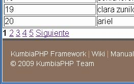
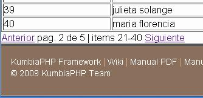
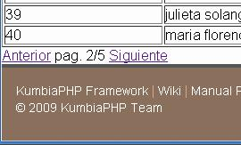

# Appendices

## Integration of jQuery and KumbiaPHP

KumbiaPHP provides integration with the JavaScript Framework jQuery

### KDebug

KDebug is a new object incorporated to the integration plugins at KumbiaPHP/JQuery that allows a debugging of the code in development time. With just one parameter you can use a log that allow see in console (while available, if not it using alert) allowing a better control of the execution.

It's not necessary, but will be helpful if you work with tools like Firebug in Mozilla Firefox o some browser that use the WebKit console, like Google Chrome.

## Application in production

All

## Partials of paging

As complement to the ActiveRecord, paged through partial views are implemented types of pacciona more common. These are located in the directory "core/views/partials/paginators" ready to be used. They are fully configurable via CSS. Of course, you can create your own partials for pagination in views.

### Classic

Classic pagination view



Final result

Configuration parameters:

page: object obtained from paginator.

show: number of pages to be shown in the paginator. Default 10.

url: URL for the action that performs pacciona it, by default "module/controller/page /" and the page number is sent by parameter.

```php
View::partial('paginators/classic', false, array ( 'page' => $page, 'show' => 8, 'url' => 'user/list'));
```

* * *

### Digg

View paging style digg.

Configuration parameters:

page: object obtained from paginator.

show: number of pages to be shown in the paginator. Default 10.

URL: url for the action that performs pacciona it, by default "module/controller/page /" and the page number is sent by parameter.

```php
View:partial (' paginators/digg', false, array('page' => $page, 'show' => 8, 'url' => 'usuario/lista'));
```

* * *

### Extended



Final result

Classic's file pagination view.

Configuration parameters:

page: object obtained from paginator.

url: url para la accion que efectúa la pacciona , por defecto "module/controller/page/" y se envía por parámetro el número de página.

```php
View::partial('paginators/extended', false, array('page' => $page, 'url' => 'usuario/lista'));
```

* * *

### Punbb

View paging style punbb.

Configuration parameters:

page: object obtained from paginator.

show: number of pages to be shown in the paginator. Default 10.

url: url para la acción que efectúa la paginación, por defecto "module/controller/page/" y se envia por parámetro el número de página.

```php
View::partial('paginators/punbb', false, array('page' => $page, 'show' => 8, 'url' => 'usuario/lista'));
```

* * *

### Simple



Final result

View paging style simple.

Configuration parameters:

page: object obtained from paginator.

url: url para la acción que efectua la paginación , por defecto "module/controller/page/" y se envía por parámetro el número de página.

```php
View::partial('paginators/simple', false, array('page' => $page, 'url' => 'usuario/lista'));
```

* * *

### Sample Usage

Suppose we want to paginate a list of users.

For model User in "models/user.php":

```php
<?php  
class User extends ActiveRecord
{  
  /**  
    * Displays users five by five using "paginador"
    *
    * @param int $page
    * @return object
    **/
  public function displayUsers($page=1)
  {
      return $this->paginate("page: $page", 'per_page: 5');
  }
}

```

For the UserController controller in "controllers/usuario_controller. php":

```php
<?php  
//Load::models('user'); //Required in versions < 1.0

class UserController extends AppController
{
  /**
    * Paged action
    *
    * @param int $page
    **/
  public function page($page=1)
  {
      $this->page = (new Usuario)->displayUsers($page);
  }
}

```

And in the view "views/user/page.phtml"

```php
<table>
<tr>
<th>Id</th>
<th>Name</th>
</tr>
<?php foreach($page->items as $p) : ?>
<tr>
<td><?= $p->id ?></td>
<td><?= $p->name ?></td>
</tr>
<?php endforeach ?>
</table>

<?php  View::partial('paginators/classic', false, ['page' => $page]) ?>
```

* * *

* * *

## Auth

* * *

## Beta1 to Beta2

* * *

## Deprecated

## Methods and classes that were used in previous versions and still work

But they are deprecated and will not work in the future (next beta or final release):

Possibly there will be 2 versions:

Compatible with beta2, supports deprecated to facilitate migration

1.0 = without the deprecated more clean and fast, to start new apps

| 0.5 | beta1 | beta2 v0.9 | v1.0 |
| --- | ----- | ---------- | ---- |
|     |       |            |      |

Flash::success() now is Flash::valid()

Flash::notice() now is Flash::info()

ApplicationController now is AppController (with their respective method changes)

...

Use $this->response = 'view' or View:response('view') to not show the template.

Now, View::template (NULL) or View::response() is used to choose alternative view formats.

### List of changes between versions: If don't specify beta1 is that it is compatible in both cases


#### Application

| 0.5                    | beta1                           | beta2 v0.9                      | v1.0                            |
| ---------------------- | ------------------------------- | ------------------------------- | ------------------------------- |
| ControllerBase         | ApplicationController           | AppController                   | AppController                   |
| public function init() | protected function initialize() | protected function initialize() | protected function initialize() |
| render_view()          | render_view()                   | View::select()                  | View::select()                  |

#### Models

| 0.5          | beta1            | beta2 v0.9       | v1.0             |
| ------------ | ---------------- | ---------------- | ---------------- |
| public $mode | public $database | public $database | public $database |

#### Callbacks

| 0.5                             | beta1                           | beta2 v0.9                         | v1.0                               |
| ------------------------------- | ------------------------------- | ---------------------------------- | ---------------------------------- |
| public function init()          | protected function initialize() | protected function initialize()    | protected function initialize()    |
| public function finalize()      |                                 | protected function finalize()      | protected function finalize()      |
| public function before_filter() |                                 | protected function before_filter() | protected function before_filter() |
| public function after_filter()  |                                 | protected function after_filter()  | protected function after_filter()  |

boot.ini is eliminated in beta2

kumbia / mail / libchart 0.5 => deletes the prefixes beta1

extensions 0.5 => libs beta1

Input::

$this->has_post 0.5 => Input:hasPost beta2

$this->has_get 0.5 => Input:hasGet beta2

$this->has_request 0.5 => Input:hasRequest beta2

$this->post 0.5 => ' Input:post beta2

$this->get 0.5 => ' Input:get beta2

$this->request 0.5 => 'Input::request beta2

View::

$this->cache 0.5 => View::cache beta2

$this->render 0.5 => 'View::select beta2

$this->set_response 0.5 => View::response beta2

content() 0.5 => View::content() beta2

render_partial 0.5 => View::partial beta2

Router::

$this->route_to 0.5 => 'Router::route_to beta1 y beta2

$this->redirect 0.5 => Router::redirect beta2

Html::

img_tag 0.5 => 'Html::img beta2

link_to 0.5 => 'Html::link beta2

link_to_action 0.5 => 'Html::linkAction beta2

stylesheet_link_tags 0.5 => 'Html::includeCss beta2

Ajax::

form_remote_tag 0.5 => 'Ajax::form beta2

link_to_remote 0.5 => 'Ajax::link beta2

Form::

end_form_tag 0.5 => 'Form::close beta2

form_tag 0.5 => 'Form::open beta2

input_field_tag 0.5 ' => 'Form::input beta2

text_field_tag 0.5 => 'Form::text beta2

password_field_tag 0.5 => 'Form::pass beta2

textarea_tag 0.5 => 'Form::textarea beta2

hidden_field_tag 0.5 => 'Form::hidden beta2

select_tag 0.5 => 'Form::select beta2

file_field_tag 0.5 => 'Form::file beta2

button_tag 0.5 => 'Form::button beta2

submit_image_tag 0.5 => 'Form::submitImage beta2

submit_tag 0.5 => 'Form::submit beta2

checkbox_field_tag 0.5 => 'Form::check beta2

radio_field_tag 0.5 => 'Form::radio beta2

Tag::

javascript_include_tag 0.5 => 'Tag::js beta2

stylesheet_link_tag 0.5 => 'Tag::css beta2

### Cambio en las rutas entre versiones:

# 0.5 => 1.0 beta1

                    '/apps/default' => '/app',
    
                    '/apps' => '',
    
                    '/app/controllers/application.php' => '/app/application.php',
    
                    '/app/views/layouts' => '/app/views/templates',
    
                    '/app/views/index.phtml' => '/app/views/templates/default.phtml',
    
                    '/app/views/not_found.phtml' => '/app/views/errors/404.phtml',
    
                    '/app/views/bienvenida.phtml' => '/app/views/pages/index.phtml',
    
                    '/app/helpers' => '/app/extensions/helpers',
    
                    '/app/models/base/model_base.php' => '/app/model_base.php',
    
                    '/app/models/base/' => '',
    
                    '/cache' => '/app/cache',
    
                    '/config' => '/app/config',
    
                    '/docs' => '/app/docs',
    
                    '/logs' => '/app/logs',
    
                    '/scripts' => '/app/scripts',
    
                    '/test' => '/app/test',
    

# 1.0 beta1 => 1.0 beta2

                …
    

Cambiados:

Session::isset_data() ahora Session::has()

Session::unset_data() ahora Session::delete()

* * *

## Glossary

CRUD = Create Read Update Delete

ABM

MVC = Model View Controller

HTML = HyperText Markup Language

SQL = Structured Query Language