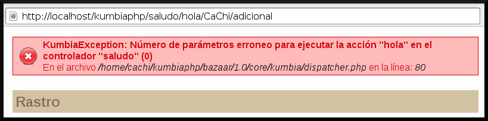
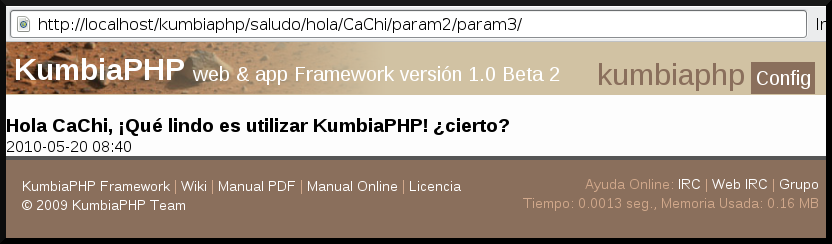

# El Controlador

En KumbiaPHP Framework, la capa del controlador, contiene el código que une la lógica de negocio con la presentación. Está dividida en varios componentes que se utilizan para diversos propósitos:

- El controlador frontal (front controller) es el único punto de entrada a la aplicación. Carga la configuración y determina la acción a ejecutarse.
- Las acciones verifican la integridad de las peticiones y preparan los datos requeridos por la capa de presentación.
- Las clases Input y Session dan acceso a los parámetros de la petición y a los datos persistentes del usuario. Se utilizan muy a menudo en la capa del controlador.
- Los filtros son trozos de código ejecutados para cada petición, antes y/o después de un controlador incluso antes y/o después de una acción. Por ejemplo, los filtros de seguridad y validación son comúnmente utilizados en aplicaciones web.

Este capítulo describe todos estos componentes. Para una página básica, es probable que solo necesites escribir algunas lineas de código en la clase de la acción, y eso es todo. Los otros componentes del controlador solamente se utilizan en situaciones específicas.

## Controlador Frontal

Todas las peticiones web son manejadas por un solo Controlador Frontal (front controller), que es el punto de entrada único de toda la aplicación.

Cuando el front controller recibe la petición, utiliza el sistema de enrutamiento de KumbiaPHP para asociar el nombre de un controlador y el de la acción mediante la URL escrita por el cliente (usuario u otra aplicación).

Veamos la siguiente URL, esta llama al script index.php (que es el front controller) y sera entendido como llamada a una acción.

http://localhost/kumbiaphp/micontroller/miaccion/

Debido a la reescritura de URL nunca se hace un llamado de forma explicita al index.php, solo se coloca el controlador, acción y parámetros. Internamente por las reglas reescritura de URL es llamado el front controller. Ver sección [¿Por qué es importante el Mod-Rewrite?](to-install.md#por-qu%C3%A9-es-importante-el-mod-rewrite)

### Destripando el Front Controller

El front controller de KumbiaPHP se encarga de despachar las peticiones, lo que implica algo mas que detectar la acción que se ejecuta. De hecho, ejecuta el código común a todas las acciones, incluyendo:

  1. Define las constantes del núcleo de la aplicación(APP_PATH, CORE_PATH y PUBLIC_PATH).
  2. Carga e inicializa las clases del núcleo del framework (bootstrap).
  3. Carga la configuración (Config).
  4. Decodifica la URL de la petición para determinar la acción a ejecutar y los parámetros de la petición (Router).
  5. Si la acción no existe, redirecciona a la acción del error 404 ( Router ).
  6. Activa los filtros (por ejemplo, si la petición necesita autenticación) ( Router ).
  7. Ejecuta los filtros, primera pasada (before). ( Router )
  8. Ejecuta la acción ( Router ).
  9. Ejecuta los filtros, segunda pasada (after) ( Router ).
 10. Ejecuta la vista y muestra la respuesta (View).

A grande rasgos, este es el proceso del front controller, esto es todo lo que necesitas saber sobre este componente el cual es imprescindible de la arquitectura MVC dentro de KumbiaPHP

### Front Controller por defecto

El front controller por defecto, llamado index.php y ubicado en el directorio *public/* del proyecto, es un simple script, como el siguiente:

```php
<?php
error_reporting ( E_ALL  ^ E_STRICT);
//define('PRODUCTION', TRUE);
define ( 'START_TIME' , microtime (1));
define ( 'APP_PATH' , dirname ( dirname ( __FILE__ )) . '/app/' );
define ( 'CORE_PATH' , dirname ( dirname (APP_PATH)) . '/core/' );
if  ($_SERVER[ 'QUERY_STRING' ]) {
    define ( 'PUBLIC_PATH' , substr ( urldecode ($_SERVER[ 'REQUEST_URI' ]), 0, - strlen ($_SERVER[ 'QUERY_STRING' ]) + 6));
} else  {
  define ( 'PUBLIC_PATH' , $_SERVER[ 'REQUEST_URI' ]);
}
$url = isset ($_GET[ '_url' ]) ? $_GET[ '_url' ] : '/' ;
require  CORE_PATH . 'kumbia/bootstrap.php' ;
```

La definición de las constantes corresponde al primer paso descrito en la sección anterior. Después el controlador frontal incluye el bootstrap.php de la aplicación, que se ocupa de los pasos 2 a 5. Internamente el core de KumbiaPHP con sus componente Router y View ejecutan todos los pasos subsiguientes.

Todas las constantes son valores por defecto de la instalación de KumbiaPHP en un ambiente local.

### Constantes de KumbiaPHP

Cada constante cumple un objetivo específico con el fin de brindar mayor flexibilidad al momento de crear rutas (paths) en el framework.

#### APP_PATH

Constante que contiene la ruta absoluta al directorio donde se encuentra la aplicación (app), por ejemplo:

```php
echo APP_PATH; 
//la salida es: /var/www/kumbiaphp/default/app/ 
```

Con esta constante es posible utilizarla para incluir archivos que se encuentre bajo el árbol de directorio de la aplicación, por ejemplo si quiere incluir un archivo que esta en el directorio app/libs/test.php la forma de hacerlo seria.

```php
include_once APP_PATH.'libs/test.php' ;
```

#### CORE_PATH

Constante que contiene la ruta absoluta al directorio donde se encuentra el core de KumbiaPHP. por ejemplo:

```php
echo CORE_PATH;
//la salida es: /var/www/kumbiaphp/core/
```

Para incluir archivos que se encuentre bajo este árbol de directorios, es el mismo procedimiento que se explicó para la constante APP_PATH.

#### PUBLIC_PATH

Constante que contiene la URL para el navegador (browser) y apunta al directorio *public/* para enlazar imágenes, CSS, JavaScript y todo lo que sea ruta para el navegador.

```php
//Genera un link que ira al 
//controller: controller y action: action
<a href=" <?php echo PUBLIC_PATH ?>controller/action/" title="Mi Link">Mi
Link</a>

//Enlaza una imagen que esta en public/img/imagen.jpg
img/imagen.jpg" alt="Una Imagen" />

//Enlaza el archivo CSS en public/css/style.css
<link rel="stylesheet" type="text/css" href=" <?php echo PUBLIC_PATH ?>
css/style.css"/>
```

## Las Acciones

Las acciones son la parte fundamental en la aplicación, puesto que contienen el flujo en que la aplicación actuará ante ciertas peticiones. Las acciones utilizan el modelo y definen variables para la vista. Cuando se realiza una petición web en una aplicación KumbiaPHP, la URL define una acción y los parámetros de la petición. Ver sección [KumbiaPHP y sus URLs](first-app.md#kumbiaphp-y-sus-urls)

Las acciones son métodos de una clase controladora llamada ClassController que hereda de la clase AppController y pueden o no ser agrupadas en módulos.

### Las acciones y las vistas

Cada vez que se ejecuta una acción, KumbiaPHP busca entonces una vista (view) con el mismo nombre de la acción. Este comportamiento se ha definido por defecto. Normalmente las peticiones deben dar una respuesta al cliente que la ha solicitado, entonces si tenemos una acción llamada *saludo()* debe existir una vista asociada a esta acción llamada *saludo.phtml*. Habrá un capítulo más extenso dedicado a la explicación de las vistas en KumbiaPHP.

### Obtener valores desde una acción

Las URLs de KumbiaPHP están caracterizadas por tener varias partes, cada una de ellas con una función conocida. Para obtener desde un controlador los valores que vienen en la URL podemos usar algunas propiedades definidas en el controlador.

Tomemos la URL:

http://www.example.com/noticias/ver/12/

- El Controlador: noticias
- La accion: ver
- Parametros: 12

```php
<?php
/** 
 * Controller Noticia
 */ 
class NoticiasController extends AppController{
    /** 
     * método para ver la noticia
     * @param int $id
     */ 
    public function ver($id){
        echo $this->controller_name;//noticias   
        echo $this->action_name;//ver   
        //Un array con todos los parámetros enviados a la acción   
        var_dump($this-> parameters);   
   }
}
```

Es importante notar la relación que guardan los parámetros enviados por URL con la acción. En este sentido KumbiaPHP tiene una característica, que hace seguro el proceso de ejecutar las acciones y es que se limita el envío de parámetros tal como se define en la método (acción). Lo que indica que todos los parámetros enviados por URL son argumentos que recibe la acción. Ver sección [KumbiaPHP y sus URLs](first-app.md#kumbiaphp-y-sus-urls)

En el ejemplo anterior se definió en la acción *ver($id)* un sólo parámetro, esto quiere decir que si no se envía ese parámetro o se intentan enviar más parámetros adicionales KumbiaPHP lanza una excepción (en producción muestra un error 404). Este comportamiento es por defecto en el framework y se puede cambiar para determinados escenarios según el propósito de nuestra aplicación para la ejecución de una acción.

Tomando el ejemplo «Hola Mundo» ponga en práctica lo antes explicado y lo hará enviando parámetros adicionales al método hola($nombre) el cual sólo recibe un parámetro (el nombre) http://localhost/kumbiaphp/saludo/hola/CaChi/adici onal, en la figura 3.1 vera la excepción generada por KumbiaPHP.



Figura 3.1: Excepción de número de parámetros erróneos.

Siguiendo en el mismo ejemplo imaginemos que requerimos que la ejecución de la acción *hola()* obvie la cantidad de parámetros enviados por URL, para esto solo tenemos que indicarle a KumbiaPHP mediante el atributo $limit_params que descarte el número de parámetros que se pasan por URL.

```php
<?php
/** 
 * Controller Saludo
 */ 
class SaludoController extends AppController {
    /** 
     * Limita la cantidad correcta de
     * parámetros de una acción 
     */ 
    public $limit_params = FALSE;
   ... métodos ...
}
```

Cuando tiene el valor FALSE como se explico antes, descarta la cantidad de parámetros de la acción. Ingresa a la siguiente URL [http://localhost/kumbiaph p/saludo/hola/CaChi/param2/param3/] y verá como ya no esta la excepción de la figura 3.1 y puede ver la vista de la acción como muestra la figura 3.2.



Figura 3.2: Descartando la cantidad de parámetros de la acción.

## Convenciones y Creación de un Controlador

### Convenciones

Los controladores en KumbiaPHP deben llevar las siguientes convenciones y características:

El archivo debe ser creado solo en el directorio *app/controllers/*. El archivo debe tener el nombre del controlador y la terminación *_controller.php*, por ejemplo *saludo_controller.php*.

El archivo debe contener la clase controladora con el mismo nombre del archivo en notación **CamelCase**. Retomando el ejemplo anterior el nombre de la clase controladora sera SaludoController.

### Creación de un Controlador

Ahora ponemos en práctica lo visto anteriormente y crearemos un controlador (controller) llamado saludo.

```php
<?php
/** 
 * Controller Saludo
 */ 
class SaludoController extends AppController {
}
```

### Clase AppController

Es importante recordar que KumbiaPHP es un framework MVC y POO. En este sentido existe AppController y es la super clase de los controladores, todos deben heredar (extends) de esta clase para tener las propiedades (atributos) y métodos que facilitan la interacción entre la capa del modelo y presentación.

La clase AppController esta definida en *app/libs/app_controller.php* es una clase muy sencilla de usar y es clave dentro del MVC.

### Acciones y Controladores por defecto

## Filtros

Los controladores en KumbiaPHP poseen unos métodos útiles que permiten realizar comprobaciones antes y después de ejecutar un controlador y una acción, los filtros pueden ser entendidos como un mecanismo de seguridad en los cuales se puede cambiar el procesamiento de la petición según se requiera (por ejemplo verificar si un usuarios se encuentra autenticado en el sistema).

KumbiaPHP corre los filtros en un orden lógico, para manipular comprobaciones, a nivel de toda la aplicación o bien en particularidades de un controlador.

### Filtros de Controladores

Los filtros de controladores se ejecutan antes y después de un controlador son útiles para comprobaciones a nivel de aplicación, como por ejemplo verificar el modulo que se esta intentando acceder, sesiones de usuarios, etc. Igualmente se puede usar para proteger nuestro controlador de información inadecuada.

Los filtros son métodos los cuales sobrescribimos (característica POO) para darle el comportamiento deseado.

#### initialize()

KumbiaPHP llama al método *initialize()* antes de ejecutar el controlador y se encuentra definido para ser usado en la clase AppController. [Ver sección AppController](controller.md#clase-appcontroller).

#### finalize()

KumbiaPHP llama al método *finalize()* después de ejecutar el controlador y se encuentra definido para ser usado en la clase AppController. [Ver sección AppController](controller.md#clase-appcontroller).

### Filtros de Acciones

Los filtros de acciones se ejecutan antes y después de una acción son útiles para comprobaciones a nivel de controller, como por ejemplo verificar que una petición es asíncrona, cambiar tipos de respuesta, etc. Igualmente se puede usar para proteger nuestra acción de información inadecuada que sea enviada a ellos.

#### before_filter()

KumbiaPHP llama al método *before_filter()* antes de ejecutar la acción del controlador y es útil para verificar si una petición es asíncrona entre otros.

#### after_filter()

KumbiaPHP llama al método *after_filter()* después de ejecutar la acción del controlador y es útil para cambiar valores de sesión entre otros.