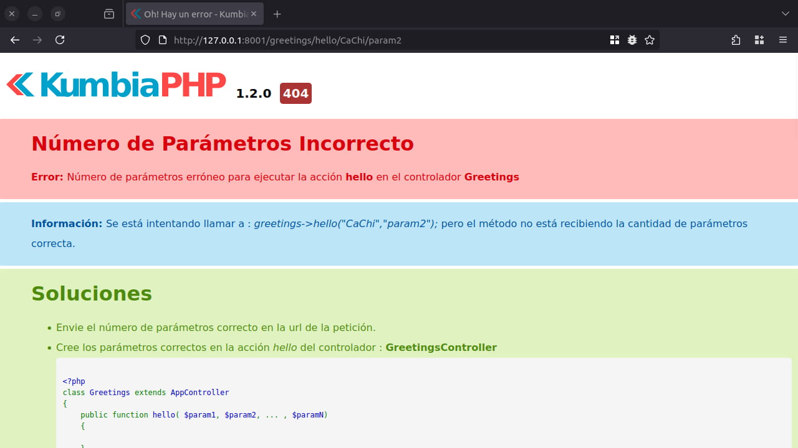
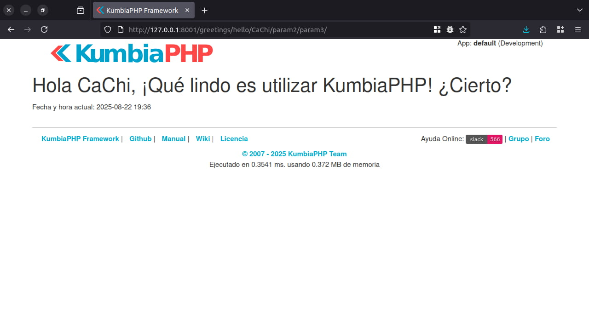
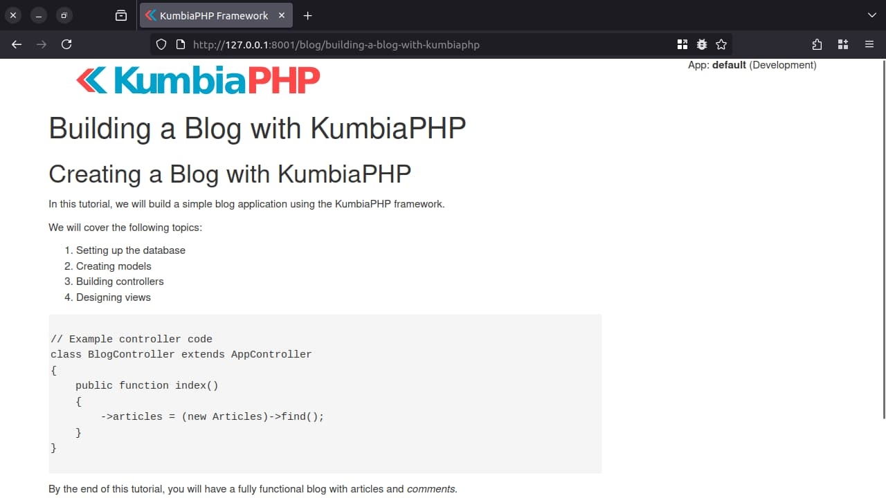

# Controller

In the KumbiaPHP Framework, the controller layer connects business logic with presentation logic. It is composed of
several elements used for different purposes:

- **Actions:** Verify the integrity of requests and prepare the data required by the presentation layer.
- **Helper classes (`Input`, `Session`, and others):** Provide access to request parameters and the user's persistent
  data.
- **Filters:** Are pieces of code executed before and/or after a controller or an action. They can validate requests,
  apply security rules, or modify the response.

For a basic page, you will usually need only a few lines in the corresponding action. The other controller components
are used when the scenario requires them.

## Actions

Actions are fundamental in the application because they define the flow in which the application will respond to
specific requests. Actions utilize the model and define variables for the view. When a web request is made in a
KumbiaPHP application, the URL defines an action and the request parameters. Refer to the
[KumbiaPHP and URLs](first-app.md#kumbiaphp-and-urls) section.

Actions are methods of a controller class, called `ClassController` in this convention, which inherits from the
`AppController` class. Controllers can be organized into modules or used without modules.

### Actions and Views

Each time an action is executed, KumbiaPHP searches for a view with the same name as the action. This behavior is set
by default. Usually, requests need to respond to the client who made the request. Therefore, if we have an action called
`greeting()`, there should be an associated view called `greeting.phtml`. A more comprehensive chapter will explain
views in KumbiaPHP.

### Getting Values from an Action

KumbiaPHP URLs consist of several parts, each serving a specific function. To access the values from a controller that
are sent in the URL, you can use some properties defined in the controller.

Consider the following URL:

http://www.example.com/news/show/12/

- Controller: News
- Action: show
- Parameters: 12

```php
<?php
/** 
 * News Controller
 */ 
class NewsController extends AppController {
    /** 
     * Method to show the news item
     * @param int $id
     */ 
    public function show($id) {
        echo $this->controller_name; // news   
        echo $this->action_name; // show   
        // An array with all parameters sent to the action   
        var_dump($this->parameters);   
    }
}
```

It's essential to note the relationship between the parameters sent via URL and the action. KumbiaPHP has a feature that
makes action execution secure: parameter transmission is limited to what is defined in the method. In other words, all
parameters sent via the URL are arguments received by the action. See the [KumbiaPHP and URLs](first-app.md#kumbiaphp-and-urls)
section.

### Automatic Parameter Count Validation

By default, KumbiaPHP prevents more parameters from being passed than are declared in the action method signature. If
`show()` is called without `$id`, or with additional parameters, the framework throws an exception (in production, it
returns a 404 error).

#### Example: Exception Due to Parameter Count

The following action accepts only the visitor's name:

```php
<?php

/**
 * Greeting Controller - Strict Parameters
 */
class GreetingController extends AppController
{
    /**
     * Greets the user.
     *
     * @param string $name The visitor's name.
     * @return void
     */
    public function hello($name)
    {
        $this->name = $name;
        $this->date = date('Y-m-d H:i');
    }
}
```

If you visit `http://localhost/kumbiaphp/greeting/hello/CaChi/param2/`, KumbiaPHP displays an exception because the
action received more parameters than it declares.



#### Allowing Additional Parameters with `$limit_params`

To remove the parameter-count restriction for an action or an entire controller, set the `$limit_params` property to
`false`:

```php
<?php

/**
 * Greeting Controller - Flexible Parameters
 */
class GreetingController extends AppController
{
    /**
     * Ignores the exact number of parameters for all actions in this controller.
     */
    public $limit_params = false;

    /**
     * Greets the user.
     *
     * @param string $name The visitor's name.
     * @return void
     */
    public function hello($name)
    {
        $this->name = $name;
        $this->date = date('Y-m-d H:i');
    }
}
```

When this property is set to `false`, KumbiaPHP ignores the number of parameters passed to the action. Visit
`http://localhost/kumbiaphp/greeting/hello/CaChi/param2/param3/` to render the view without an exception, as shown in
Figure 3.2.



## Conventions and Creating a Controller

### Conventions

Controllers in KumbiaPHP must adhere to the following conventions and characteristics:

- The file must be created in the `app/controllers/` directory.
- The file must have the same name as the controller and end with `_controller.php`; for example,
  `greeting_controller.php`.
- The file must contain a controller class with the same name as the file, using **CamelCase** notation. In the previous
  example, the class name would be `GreetingController`.

### Creating a Minimal Controller

The following example creates a minimal `Greeting` controller:

```php
<?php

/**
 * Greeting Controller
 */
class GreetingController extends AppController
{
}
```

### AppController Class

KumbiaPHP is an MVC and OOP framework. `AppController` is the superclass for controllers. All controllers must inherit
(extend) this class to obtain the attributes and methods that facilitate interaction between the model and presentation
layers.

The `AppController` class is defined in `app/libs/app_controller.php`. It is a key component of the MVC architecture and
provides common utilities such as filters, helpers, and access to the view layer.

### AdminController

`AdminController` extends the idea of a common entry point to protected areas of a site, such as administration panels or
back-office sections. Administrative controllers should extend this class to inherit unified authentication and
authorization rules.

> **Note:** Future framework versions will include a basic authentication implementation for this class.

## Filters

Controllers in KumbiaPHP have methods that allow checks to be performed before and after executing a controller or an
action. Filters are especially useful as a security mechanism because they can alter request processing as needed, such
as by checking whether a user is authenticated.

KumbiaPHP runs filters in a logical order so that checks can be applied at the application level or specifically to a
controller.

### Controller Filters

Controller filters run before and after a complete controller. They are useful for application-level checks, such as
verifying the module being accessed or the user's session. They can also protect the controller from inappropriate data.

Filters are methods that can be overridden, an object-oriented programming feature, to provide the required behavior.

#### `initialize()`

KumbiaPHP calls `initialize()` before executing the controller. The method is defined in `AppController` for this purpose.
See the [AppController Class](controller.md#appcontroller-class) section.

#### `finalize()`

KumbiaPHP calls `finalize()` after executing the controller. The method is defined in `AppController` for this purpose.
See the [AppController Class](controller.md#appcontroller-class) section.

### Action Filters

Action filters run before and after a specific action. They are useful for controller-level checks, such as verifying
that a request is asynchronous or changing the response type. They can also protect actions from inappropriate
information.

#### `before_filter()`

KumbiaPHP calls `before_filter()` before executing the controller's action. It is useful for checking whether a request
is asynchronous, among other things.

#### `after_filter()`

KumbiaPHP calls `after_filter()` after executing the controller's action. It can be used to modify session values, among
other tasks.

## Default Actions and Controllers

When a URL does not specify a controller or an action, the KumbiaPHP dispatcher invokes `IndexController` and its
`index` action by default.

What happens when a URL specifies an existing controller but an action that is not declared in it? By default, the
framework returns a 404 error. This situation can be intercepted and handled more flexibly with PHP's magic `__call()`
method.

PHP executes `__call()` automatically when an inaccessible or nonexistent method is invoked on an object. By overriding
it in a controller, you can decide what to do before KumbiaPHP returns an error to the user. Common uses include:

- Rendering **static views** without creating empty actions.
- Serving **dynamic pages** stored in a database based on a slug in the URL.
- Customizing 404 handling while keeping the logic inside the controller.

The following two patterns use `__call()` in common real-world scenarios.

### Static Views with `__call()`

A typical example is a help or documentation site where each page corresponds to a `.phtml` file inside
`app/views/pages/`. Instead of defining dozens of empty methods in a controller, the controller can load the view that
matches the requested action. KumbiaPHP includes a similar example by default:

```php
<?php

class PagesController extends AppController
{
    protected function before_filter()
    {
        // If the request is AJAX, send only the view
        if (Input::isAjax()) {
            View::template(null);
        }
    }

    public function __call($name, $params)
    {
        View::select(implode('/', [$name, ...$params]));
    }
}
```

With this controller, adding a new help page only requires creating its view in `app/views/pages/`. For example, the URL
`/pages/faq` attempts to load `pages/faq.phtml`. If the view does not exist, KumbiaPHP displays a **404 Page not found**
view.

### Database-Backed Dynamic Pages with `__call()`

Another common case is a small CMS in which pages are identified by a **slug** stored in the database. The controller
captures the slug, looks up the record with ActiveRecord, and renders the content using a generic view.

```php
<?php

/**
 * Serves pages with dynamic blog content.
 */
class BlogController extends AppController
{
    /**
     * Finds an article by its slug and renders the corresponding view.
     *
     * @param string $name Slug of the blog entry.
     * @param array $args Additional parameters (unused).
     * @return void
     */
    public function __call($name, $args)
    {
        $this->slugShow($name, $args);
    }

    /**
     * Displays the list of blog articles.
     *
     * @return void
     */
    public function index(): void
    {
        $this->articles = (new Articles)->all();
    }

    /**
     * Finds an article by its slug and renders the corresponding view.
     *
     * @param string $slug Slug of the blog entry.
     * @param array $args Additional parameters (unused).
     * @return void
     */
    private function slugShow(string $slug, array $args): void
    {
        $this->article = (new Articles)->getBySlug($slug);

        View::select('slugShow');
    }
}
```

#### Generic view: `app/views/blog/slugShow.phtml`

```php
<?php
if (!$article) {
    View::partial('articles/404');
    return 1;
}
?>

<h1><?= h($article->title) ?></h1>
<div class="content">
    <?= strip_tags($article->content, '<p><br><h1><h2><ul><ol><li><em><b><a><blockquote><code><pre>') ?>
</div>
```

With this configuration, any URL matching `/blog/<slug>` works without creating additional methods:

- `/blog/buscador-avanzado-texto-completo-kumbiaphp-meilisearch` searches for
  `slug = 'buscador-avanzado-texto-completo-kumbiaphp-meilisearch'` in the **articles** table and displays the content.
- `/blog/optimizando-la-renderizacion-condicional-en-vistas-de-kumbiaphp-con-return-1` follows the same flow using the
  same generic view.



If the page does not exist, the same controller can display a message and return a customized 404 response.

With these patterns, `__call()` becomes a powerful tool for keeping KumbiaPHP controllers thin and flexible within the
MVC architecture. It avoids duplicated code and improves the project's extensibility.
