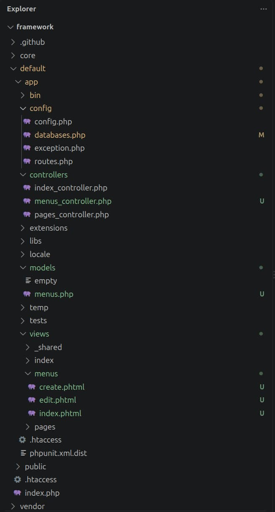
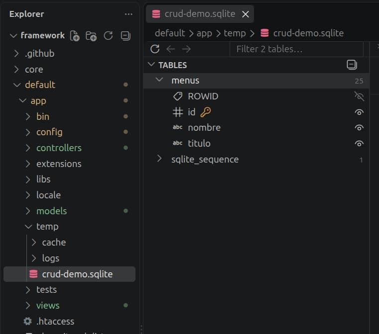
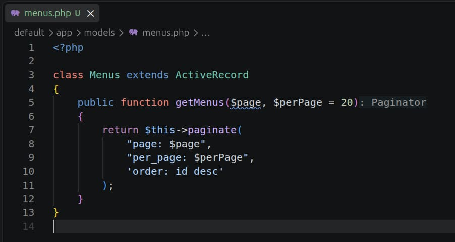

# Building a Menus CRUD with KumbiaPHP

This tutorial builds a small CRUD for the `menus` table. The example uses
KumbiaPHP conventions and `ActiveRecord`: it does not need a Scaffold or
change the framework's behavior.

> **Example scope**
>
> This code is for learning the MVC flow and basic persistence operations. It
> is not a complete implementation of authentication, authorization, or CSRF
> protection. In particular, `del($id)` remains an educational action invoked
> from a GET link; before using a similar flow in production, define the
> appropriate protections for your application.

## Objectives

By the end of this tutorial, you will be able to:

- relate a `menus` table to a `Menus` model;
- receive requests in the `index`, `create`, `edit`, and `del` actions;
- display data and messages in `.phtml` views;
- create, list, edit, delete, and paginate records; and
- follow a URL from the front controller to the view.

## Prerequisites

You need:

1. A KumbiaPHP application that you can run in your environment.
2. Access to a database and permission to create the example table.
3. Basic knowledge of PHP, SQL, and editing files.
4. A connection configured for the environment that you will use. Do not copy
   example credentials; use the values from your installation.

If you need to prepare the connection, first see [Configuring Database
Connection](active-record.md#configuring-database-connection). The current
template uses `databases.php`; the manual also documents `databases.ini` as
legacy compatibility.

## Final result

After completing the steps, you will have:

- a list of menus ordered by descending `id`;
- a form for adding a menu;
- a form for editing an existing menu;
- links for editing or deleting each record; and
- previous/next navigation when there are multiple pages.

The example's relative routes are:

| Route | Expected result |
| --- | --- |
| `/menus/` | Lists the first page; `index` is the default action. |
| `/menus/index/2/` | Lists page 2 when it exists. |
| `/menus/create/` | Displays and processes the create form. |
| `/menus/edit/ID/` | Displays and processes the edit form for record `ID`. |
| `/menus/del/ID/` | Performs the educational deletion of record `ID`. |

Replace the prefix with your application's public URL. The example does not
assume a particular domain, port, or subdirectory.

## Overview: CRUD and MVC

CRUD summarizes four operations on data:

| Operation | Controller action | `ActiveRecord` operation | What the user observes |
| --- | --- | --- | --- |
| Create | `create` | `create()` | A form and a result message. |
| Read | `index` | `paginate()` | A list of menus and its links. |
| Update | `edit` | `update()` | A form with the current values. |
| Delete | `del` | `delete()` | The list without the deleted record. |

In KumbiaPHP, the MVC flow in this example is:

1. The front controller receives the URL and routing identifies the controller,
   action, and parameters.
2. `MenusController` receives the request and calls `Menus` when it needs to
   read or change data.
3. The action assigns public attributes, such as `$this->listMenus`.
4. KumbiaPHP loads the view that matches the action name, and the view
   generates the HTML response.

For a general explanation, see [Model, View, Controller
(MVC)](mvc.md#model,-view,-controller-mvc). This tutorial adds only the
specific CRUD flow.

## File structure

In the following paths, `[app]` represents the application's directory. In the
versioned template in this checkout, it corresponds to `framework/default/app/`;
your installation may use a different location.

```text
[app]/
├── config/
│   ├── databases.php
│   └── routes.php       # optional; this example uses conventions
├── models/
│   └── menus.php
├── controllers/
│   └── menus_controller.php
└── views/
    └── menus/
        ├── index.phtml
        ├── create.phtml
        └── edit.phtml
```

The `routes.php` file is optional here: the routes above follow the
`controller/action/parameters` convention. You only need a custom route if
your application changes that scheme.



*Files that make up the menus CRUD.*

## Step 1: Prepare the database

### 1.1 Configure the connection

Open `[app]/config/databases.php` and complete the connection for the
environment you use with the values from your installation. The current
template defines the `development` connection in an array; check the key names
and supported engines in [Configuring Database
Connection](active-record.md#configuring-database-connection).

Do not include real passwords in the tutorial, screenshots, or version control.
The configuration file only describes how the application connects; the table
must be created in that same database.

### 1.2 Create `menus`

Run the following block in the database client for your environment:

```sql
CREATE TABLE menus
(
    id     INT          NOT NULL AUTO_INCREMENT,
    nombre VARCHAR(100),
    titulo VARCHAR(100) NOT NULL,
    PRIMARY KEY (id)
);
```

This SQL is specific to **MySQL** because it uses `AUTO_INCREMENT`. If you use
another engine, adapt the auto-increment definition to that engine's syntax; do
not assume that this block works unchanged.

The model convention makes `Menus` use the `menus` table. `id` is the primary
key, `titulo` is required, and `nombre` may be empty in this learning version.



*The `menus` table created in the development database.*

## Step 2: Create the model

### 2.1 Create the file

Create `[app]/models/menus.php` with this content:

```php
<?php

class Menus extends ActiveRecord
{
    public function getMenus($page, $perPage = 20)
    {
        return $this->paginate(
            "page: $page",
            "per_page: $perPage",
            'order: id desc'
        );
    }
}
```

In the current configuration, `ActiveRecord` is loaded automatically. The
model constructor also accepts an array of data; the controller will use it to
create a record from the form.

`getMenus()` delegates the query and pagination to `ActiveRecord`. The object
returned by `paginate()` contains, among other values, `items`, `prev`, `next`,
`current`, `total`, `count`, and `per_page`. See [ActiveRecord](active-record.md#activerecord)
and [Paging in ActiveRecord](active-record.md#paging-in-activerecord) for the
complete reference; it is not repeated here.



*The `Menus` model with the example's paginated query.*

## Step 3: Create the controller

### 3.1 Implement the four actions

Create `[app]/controllers/menus_controller.php`:

```php
<?php

class MenusController extends AppController
{
    public function index($page = 1)
    {
        $page = max(1, (int) $page);
        $this->listMenus = (new Menus)->getMenus($page);
    }

    public function create()
    {
        if (Input::hasPost('menus')) {
            $menu = new Menus(Input::post('menus'));

            if ($menu->create()) {
                Flash::valid('Operation successful.');
                Input::delete();
                return;
            }

            Flash::error('Could not create the menu.');
        }
    }

    public function edit($id)
    {
        $menu = new Menus();

        if (Input::hasPost('menus')) {
            if ($menu->update(Input::post('menus'))) {
                Flash::valid('Operation successful.');
                return Redirect::to();
            }

            Flash::error('Could not update the menu.');
            return;
        }

        $this->menus = $menu->find_by_id((int) $id);
    }

    public function del($id)
    {
        if ((new Menus)->delete((int) $id)) {
            Flash::valid('Operation successful.');
        } else {
            Flash::error('Could not delete the menu.');
        }

        return Redirect::to();
    }
}
```

### 3.2 What each action does

- `index($page)` normalizes the page number, calls `getMenus()`, and exposes
  the result as `$listMenus` for `index.phtml`.
- `create()` detects the `menus` group in the `POST`, constructs `Menus` with
  that array, and calls `create()`. After saving, it clears the `POST` data and
  remains in the action; this example does not redirect.
- `edit($id)` loads the record on the initial request. When it receives the
  form, `update()` uses the submitted `id` and, on success, redirects to the
  current controller through `Redirect::to()`.
- `del($id)` converts the URL parameter to an integer, calls `delete()`, and
  redirects to the current controller.

Actions become views with the same name by convention. For more detail, see
[Actions and Views](controller.md#actions-and-views) and [Conventions and
Creating a Controller](controller.md#conventions-and-creating-a-controller).
The operation reference is in [create()](active-record.md#create),
[update()](active-record.md#update), and [delete()](active-record.md#delete).

## Step 4: Create the views

KumbiaPHP looks for these views under `[app]/views/menus/` because the
controller is named `MenusController`. [Sending data to the
view](view.md#send-data-to-the-view) explains why `$this->listMenus` arrives as
`$listMenus`; [Output buffer](view.md#output-buffer) explains the role of
`View::content()`.

### 4.1 List: `index.phtml`

Create `[app]/views/menus/index.phtml`:

```php
<div class="content">
    <?php View::content() ?>

    <h3>Menus</h3>

    <p><?= Html::linkAction('create/', 'Add menu') ?></p>

    <?php if ($listMenus->items): ?>
        <ul>
        <?php foreach ($listMenus->items as $item): ?>
            <li>
                <?= Html::linkAction('edit/' . (int) $item->id . '/', 'Edit') ?>
                <?= Html::linkAction('del/' . (int) $item->id . '/', 'Delete') ?>
                <strong><?= h((string) $item->nombre) ?> - <?= h((string) $item->titulo) ?></strong>
            </li>
        <?php endforeach ?>
        </ul>
    <?php else: ?>
        <p>No menus to display.</p>
    <?php endif ?>

    <p>
        Page <?= (int) $listMenus->current ?>
        of <?= (int) $listMenus->total ?>
    </p>

    <nav aria-label="Pagination">
        <?php if ($listMenus->prev): ?>
            <?= Html::linkAction('index/' . (int) $listMenus->prev . '/', '&lt;&lt; Previous') ?>
        <?php endif ?>

        <?php if ($listMenus->next): ?>
            <?= Html::linkAction('index/' . (int) $listMenus->next . '/', 'Next >>') ?>
        <?php endif ?>
    </nav>
</div>
```

`Html::linkAction()` creates links to another action of the current
controller. The IDs used in the routes are converted to integers, and table
values are escaped with `h()` before they are inserted into HTML. `h()` protects
the HTML context; it does not replace validation or SQL parameterization. The
previous-link label uses `&lt;&lt;` so that the generated HTML remains valid; the
browser displays it as `<< Previous`.

### 4.2 Creation: `create.phtml`

Create `[app]/views/menus/create.phtml`:

```php
<?php View::content() ?>

<h3>Create menu</h3>

<?= Form::open() ?>

<label for="menus_nombre">Name</label>
<?= Form::text('menus.nombre') ?>

<label for="menus_titulo">Title</label>
<?= Form::text('menus.titulo') ?>

<?= Form::submit('Add') ?>
<?= Form::close() ?>
```

`Form::open()` uses the current action and the `POST` method by default, so the
form returns to `create()`. The `menus.nombre` notation creates a field named
`menus[nombre]`, which `Input::post('menus')` can pass to the model.

### 4.3 Editing: `edit.phtml`

Create `[app]/views/menus/edit.phtml`:

```php
<?php View::content() ?>

<h3>Edit menu</h3>

<?= Form::open() ?>

<label for="menus_nombre">Name</label>
<?= Form::text('menus.nombre') ?>

<label for="menus_titulo">Title</label>
<?= Form::text('menus.titulo') ?>

<?= Form::hidden('menus.id') ?>
<?= Form::submit('Update') ?>
<?= Form::close() ?>
```

On a `GET` request, the controller assigns the record to `$this->menus`, and
the form helpers take the initial values from it. The hidden field keeps the
identifier so that `update()` knows which record to update. See [Class
Form](view.md#class-form) and the references for [Form::open()](view.md#form::open),
[Form::text()](view.md#form::text), [Form::hidden()](view.md#form::hidden),
[Form::submit()](view.md#form::submit), and [Form::close()](view.md#form::close)
for more options.

## Step 5: Check the routes

You do not need to add a custom route for this example. The front controller
receives the request and the router separates the controller, action, and
parameters. For more detail, see [KumbiaPHP and URLs](first-app.md#kumbiaphp-and-urls)
and [Dissecting the Front Controller](front-controller.md#dissecting-the-front-controller).

Test the routes in this order:

1. `/menus/` to open the initial list.
2. `/menus/create/` to open the create form.
3. From the list, use **Edit** to open `/menus/edit/ID/`.
4. From the list, use **Delete** to execute `/menus/del/ID/`.
5. If there are more than 20 records, open `/menus/index/2/` or use **Next >>**.

`Html::linkAction()` creates links relative to the current controller, so you
do not need to repeat `menus` in each call.

## Request and data flow

### Listing

For `/menus/index/2/`, when page 2 exists, the following occurs:

1. The router interprets `menus` as the controller, `index` as the action, and
   `2` as the parameter.
2. `MenusController::index($page)` converts the parameter to an integer and
   prevents a page below 1.
3. `Menus::getMenus()` calls `paginate()` with 20 records per page and
   `id desc` ordering.
4. The action assigns the page object to `$this->listMenus`.
5. `index.phtml` iterates over `$listMenus->items` and uses `prev` and `next` to
   build the links.

### Creating

1. `create.phtml` generates `menus[nombre]` and `menus[titulo]` fields.
2. The browser sends those fields by `POST` to the same action.
3. `Input::hasPost('menus')` detects the group and `Input::post('menus')` reads
   it.
4. The `Menus` constructor copies the known fields to the object.
5. `create()` saves the record, displays a `Flash`, and clears the `POST` data
   with `Input::delete()`. The action does not redirect after saving.

### Editing

1. The URL contains the identifier: `/menus/edit/ID/`.
2. On the initial request, `find_by_id((int) $id)` loads the record and exposes
   it as `$menus`.
3. The `Form::text()` helpers read `menus.nombre` and `menus.titulo` from that
   object; `Form::hidden('menus.id')` keeps the `id`.
4. The `POST` returns to `edit($id)`, and `update()` receives the data from the
   `menus` group.
5. When the update succeeds, `Redirect::to()` returns to the current
   controller.

### Deleting

1. The **Delete** link builds a URL with the identifier converted to an
   integer.
2. `del($id)` calls `delete((int) $id)`.
3. The action adds a `Flash` message and redirects to the list.

## Step 6: Verify the observable results

Perform the following checks. Use test values that do not contain sensitive
information.

### 6.1 Listing

1. Open `/menus/`.
2. Confirm that **Menus**, the **Add menu** link, and one row per record appear.
3. Confirm that each row shows `nombre - titulo`, as well as **Edit** and
   **Delete**.
4. If there are no records, **No menus to display.** must appear.

The view prints dynamic values with `h()`, so characters such as `<`, `>`, and
`&` must appear as text rather than being interpreted as HTML.

### 6.2 Creating

1. Open `/menus/create/`.
2. Enter a test name and title.
3. Select **Add**.
4. Confirm the **Operation successful.** message and that the action remains
   on the create view; this example does not redirect automatically.
5. Return to `/menus/` and confirm that the new record appears in the list.

If saving fails, the action displays **Could not create the menu.**. Check the
connection, table, and database constraints before changing the code.

### 6.3 Editing

1. From `/menus/`, select **Edit** for a record.
2. Confirm that the fields contain their current values.
3. Change the name or title and select **Update**.
4. Confirm the **Operation successful.** message, the redirect to the list, and
   the updated value.

### 6.4 Deleting

1. Identify a test record that can be deleted.
2. Select **Delete**.
3. Confirm the **Operation successful.** message, the redirect to the list, and
   that the record is absent.

### 6.5 Pagination

1. Create or load more than 20 test records; the model requests 20 per page.
2. Open `/menus/` and confirm that **Next &gt;&gt;** appears.
3. Go to the next page and confirm that **&lt;&lt; Previous** appears.
4. Confirm that the page text shows the current and total page values.

The result of `paginate()` also includes `count` and `per_page`, although this
view only displays `current`, `total`, `prev`, `next`, and `items`. To use
ready-made controls, see [Partials of paging](appendix.md#partials-of-paging);
it documents the `classic` and `digg` partials without changing the model
query.

## Common problems

| Symptom | What to check |
| --- | --- |
| The `menus` table does not exist or the connection fails. | Check `[app]/config/databases.php`, the selected environment, and that the SQL was run in the same database. |
| `Class Menus not found`. | Check that the file is `[app]/models/menus.php`, the class is `Menus`, and the application is using the current autoloading convention. |
| The URL returns 404 for `menus`. | Check that the filename ends in `_controller.php`, the class is `MenusController`, and the route uses the `menus` controller. |
| `index.phtml` does not receive `$listMenus`. | Check that `index()` assigns `$this->listMenus` and that the view is `[app]/views/menus/index.phtml`. |
| The form does not reach the controller. | Check that `Form::open()` and `Form::close()` are complete and that fields use `menus.nombre` and `menus.titulo`. |
| The edit action does not identify the record. | Check that `Form::hidden('menus.id')` exists, the table has `id` as its primary key, and the URL contains a valid ID. |
| **Next &gt;&gt;** does not appear. | The design uses 20 records per page; you need more than 20 records to observe another page. |
| The SQL does not work on another engine. | The block uses `AUTO_INCREMENT`, which is specific to MySQL; adapt the definition for your engine. |
| Values are interpreted as HTML. | Keep `h()` when printing database values. Remember that HTML escaping does not protect SQL queries. |
| Deleting runs when a link is opened. | This is the intentional educational GET flow; review the scope note before adapting it for a real application. |

## Final checklist

- [ ] The connection in `[app]/config/databases.php` points to my environment
      and does not contain credentials copied from the manual.
- [ ] The `menus` table exists in the configured database.
- [ ] `menus.php` defines `class Menus extends ActiveRecord`.
- [ ] `menus_controller.php` defines `index`, `create`, `edit`, and `del`.
- [ ] The views are in `[app]/views/menus/` and use the `.phtml` extension.
- [ ] `index.phtml` uses `$listMenus->items`, `prev`, and `next`.
- [ ] The forms use `Form::open()`, `Form::text()`, `Form::hidden()` when
      appropriate, `Form::submit()`, and `Form::close()`.
- [ ] Dynamic list values are printed with `h()`.
- [ ] I tested listing, creating, editing, deleting, and pagination with test
      data.
- [ ] I reviewed the example scope before adapting its deletion flow to a real
      application.

## Manual references

Use these sections as the canonical references when you need more detail:

- **Architecture:** [Model, View, Controller (MVC)](mvc.md#model,-view,-controller-mvc),
  [KumbiaPHP and URLs](first-app.md#kumbiaphp-and-urls), and [Dissecting the
  Front Controller](front-controller.md#dissecting-the-front-controller).
- **Controllers:** [Actions and Views](controller.md#actions-and-views) and
  [Conventions and Creating a Controller](controller.md#conventions-and-creating-a-controller).
- **Data:** [ActiveRecord](active-record.md#activerecord),
  [create()](active-record.md#create), [update()](active-record.md#update),
  [delete()](active-record.md#delete), [Paginators](active-record.md#paginators),
  and [Paging in ActiveRecord](active-record.md#paging-in-activerecord).
- **Views and forms:** [Sending data to the view](view.md#send-data-to-the-view),
  [Output buffer](view.md#output-buffer), [Class Form](view.md#class-form),
  [Form::open()](view.md#form::open), [Form::text()](view.md#form::text),
  [Form::hidden()](view.md#form::hidden), [Form::submit()](view.md#form::submit),
  and [Form::close()](view.md#form::close).
- **Reusable pagination:** [Partials of paging](appendix.md#partials-of-paging).

These references explain each component separately; this tutorial connects
them in one small flow so that you can verify each result.
