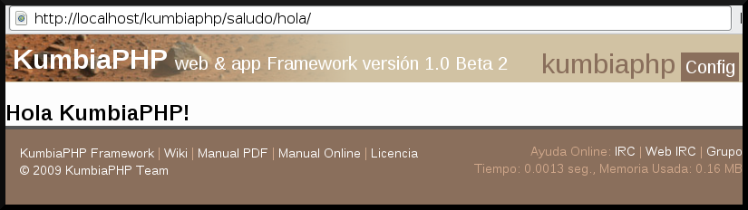
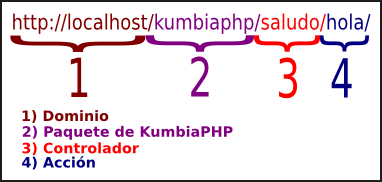
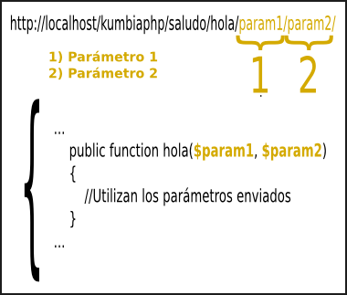
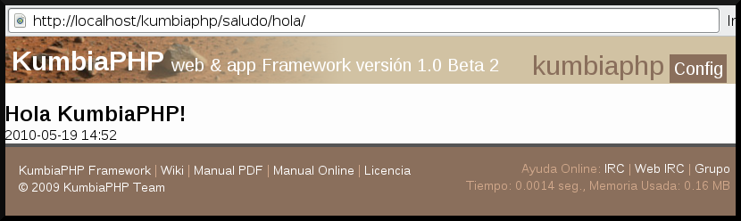
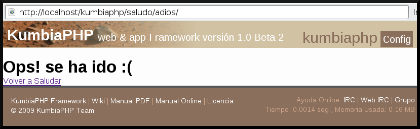

# My first app with KumbiaPHP

After you are ready with the KumbiaPHP installation, you can see the welcome page. Now it is time to create your first Hello World application. The goal is that you understand the basic components of the MVC (Model-View-Controller) architecture.

## Hello KumbiaPHP!

Now write the famous "Hello World!" but with a small change: say "Hello KumbiaPHP!". Thinking about this, remember the MVC model, according to this, KumbiaPHP should accept a petition, seeking driver and, in this, an action that serves the request. Then, KumbiaPHP uses that information to find the view associated with the request.

## Controller

Now add content to the controller app/controllers/controller/saludo_controller.php

```php
<?php
/** 
 * Controller Saludo
 */
class GreetingController extends AppController {
    public function hello() {

    }
}
 ```

In the code we have the definition of the class GreetingController, note that
Is also the Controller suffix at the end of the class declaration, this
Identifies it as a controlling class, and it inherits (extends) the
Superclass AppController, which acquires the properties of a class
Controller, there is also the hello() method.

# The view to see the output that sends the controller, it is necessary create the view associated with the action. First, create a directory with the same name of our driver (in this case must be called greeting), and inside it are all views associated with the actions that need to display some information. In our example we call an action called Hello; Therefore, we create a file called * app/views/saludo/hola.phtml*. Once this file is created, add you a little content: "'html < h1 > Hello KumbiaPHP! < / h1 >
```

Then try to access the following URL: http://localhost/kumbiaphp/saludo/hola/ and the result must be as shown Figure 2.2.

 Figure 2.2: View contents of hello.phtml

## KumbiaPHP and URLs

To understand the functioning of the framework it is important to understand their URLs, Figure 2.3 shows a typical URL in KumbiaPHP.

 Figure 2.3: URL in KumbiaPHP

In KumbiaPHP .php extensions there is this because in the first instance there is rewriting of URLs and also has a front-controller responsible for receiving all requests (more I will later explain in detail).

Any other information passed by URL is taken as the parameter of the action, with regard to our application as shown in Figure 2.4.

 Figure 2.4: URL with parameters

This is useful to avoid having to send form parameters GET? var = value & var2 = value2 (that is, in the traditional way how PHP has been used), which reveals information about the architecture of software that is available on the server. In addition, make that our URL look bad and ugly for SEO.

## Add more content

We will add some dynamic to our project, so it's not so boring. We will show the time and date, using the date() function.

We changed a bit the driver *app/controllers/greeting_controller.php*

```php
<?php
/**
 *  Controller
 */ 
class GreetingController extends AppController {
    /** 
     * metodo para saludar
     */
    public function hello() { 
       $this->date = date("Y-m-d H:i");
   }
}
```

KumbiaPHP implements the instance variables, which means that all attributes (public) defined in the controller, it happened automatically in sight, in the preceding code have the attribute $this->fecha this happened to the view as a variable called $fecha.

En la vista que se creó en la sección 2.1.3.3 y agregamos.

```php
<h1>¡Hola KumbiaPHP!</h1>
<?php echo $fecha ?>
```

Ahora, si volvemos a http://localhost/kumbiaphp/saludo/hola/, obtendremos la hora y fecha del momento en que se haga la petición, como se muestra en la figura 2.5.

 Figura 2.5: Hora y fecha de petición

Para agregarle calidez al asunto, le preguntaremos al usuario su nombre vía parámetro 2.1.3.4, volvemos a editar el controlador *saludo_controller.php*

```php
<?php
/** 
 * Controller Saludo
 */ 
class SaludoController extends AppController
{
    /** 
     * método para saludar
     * @param string $nombre
     */ 
    public function hola($nombre)
   {
       $this->fecha = date("Y-m-d H:i");
       $this->nombre = $nombre;
   }
}
```

Editamos la vista *app/views/saludo/hola.phtml*

```php
<h1>Hola <?php echo $nombre ?> , ¡Que lindo es utilizar KumbiaPHP!
¿cierto?</h1>
<?php echo $fecha ?> 
```

Si ahora entramos a *http://localhost/kumbiaphp/saludo/CaChi/* , nos mostrara en el navegador web el saludo junto con el nombre colocado y la fecha actual, como se muestra en la figura 2.6.

 Figura 2.6: Saludando al usuario

## Repeating history

Ahora vamos otra acción llamada adios() y como su nombre indica haremos el proceso inverso a saludar, es decir despedir a los usuarios.

```php
<?php
/** 
 * Controller Saludo
 */ 
class SaludoController extends AppController {
    /** 
     * método para saludar
     * @param string $nombre
     */ 
    public function hola($nombre) {
       $this->fecha = date("Y-m-d H:i");
       $this->nombre = $nombre;
   }
    /** 
     * método para despedir
     */ 
    public function adios() {

    }
}
```

Add a new view to present the contents of the action goodbye() and if we recall what was explained in the section 2.1.3.3 we should create a view *app/views/saludo/adios.phtml* with the following contents.

```php
<h1>Ops! se ha ido :( </h1>
<?php echo Html::link('saludo/hola/CaChi/', 'Volver a saludar') ?>
```

Si ingresa al siguiente enlace *http://localhost/kumbiaphp/saludo/adios/* se vera un nuevo texto, y un vinculo a la acción hola(), como se muestra en la figura 2.7.

 Figura 2.7: Vista de adiós al usuario.

Html: link (), is one of the many helper offering KumbiaPHP to facilitate at the time of scheduled hearings. We could write the HTML code directly, by placing *[back to say hello](kumbiaphp/saludo/hola/CaChi/)*, but this can lead to a problem, imagine you would rename his project in kumbiaphp demo, we would have to modify all the links, KumbiaPHP helpers solve these problems.

To write the code of our "Hello KumbiaPHP!" don't need but a controller and a view. We don't need models, since we are not working with information from a database or other type of more complex information processing.

Nos ubicamos en el directorio */path/to/kumbiaphp/app/controllers/*. Here are our drivers (for more details, read the documentation on the app directory). To create a handler, it is important to keep in mind the conventions of name which uses the Framework. We will call our driver *saludo_controller.php*. Note the suffix *_controller.php* this is part of the Naming Convention, and makes that KumbiaPHP identifies this file as a driver.