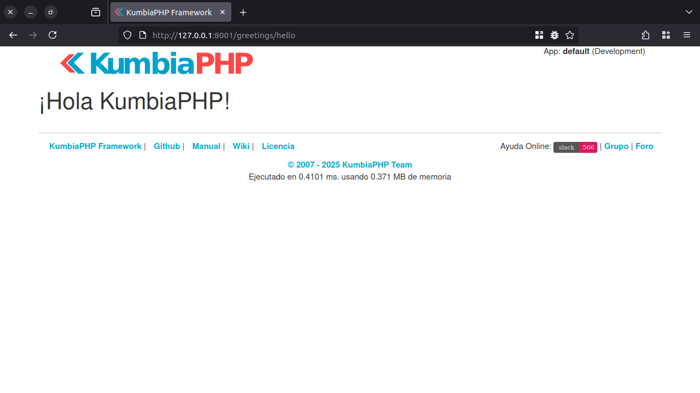
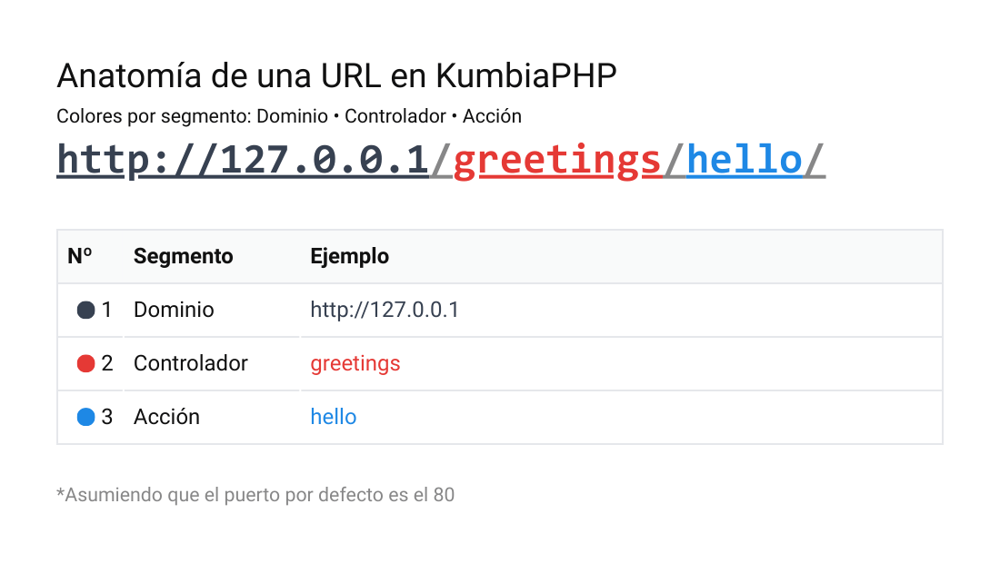
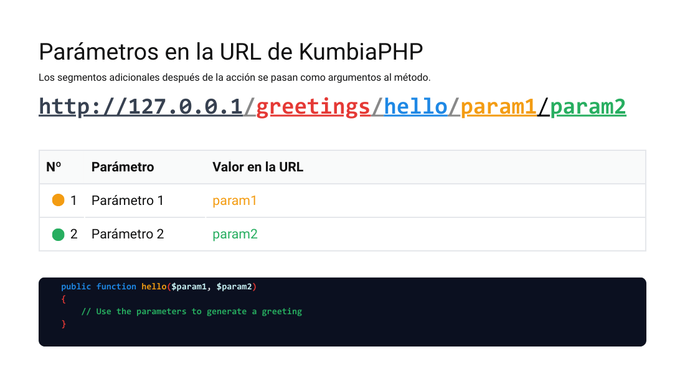
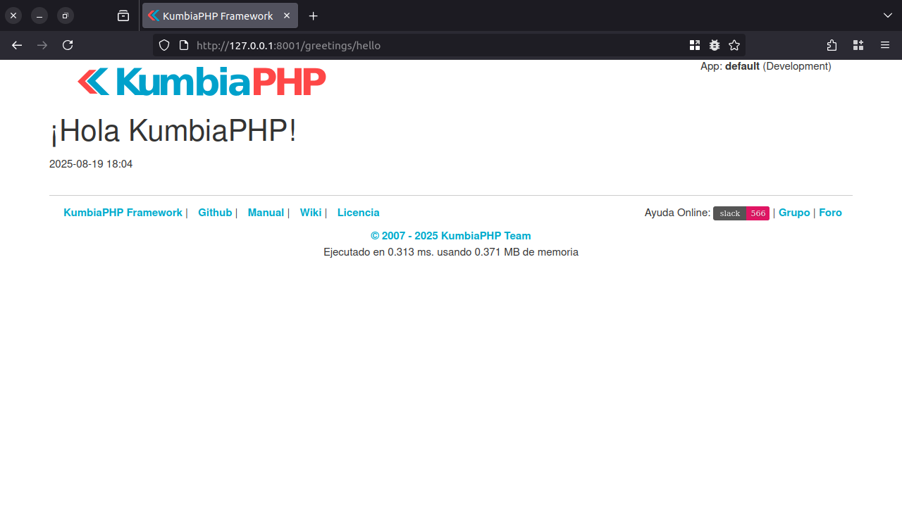
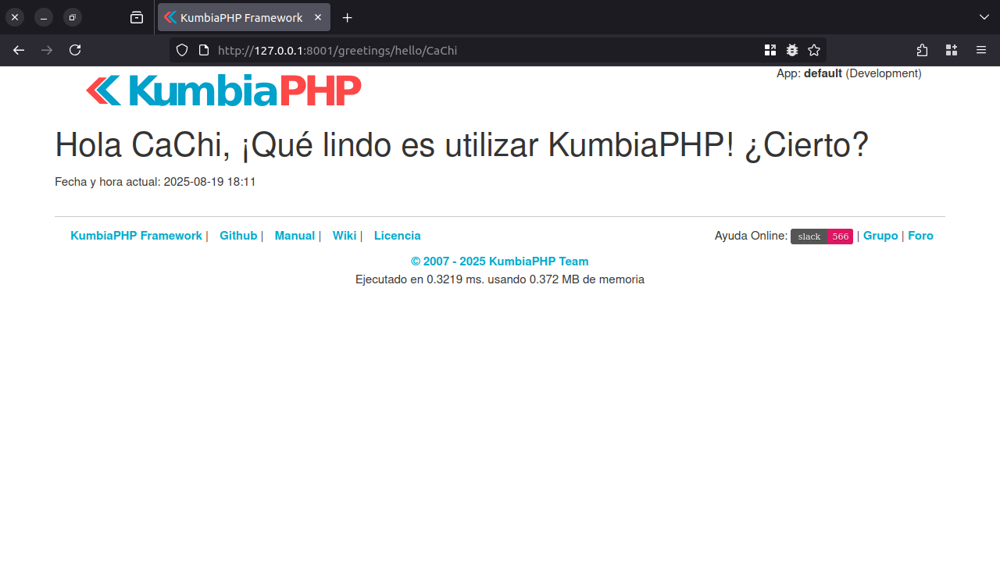
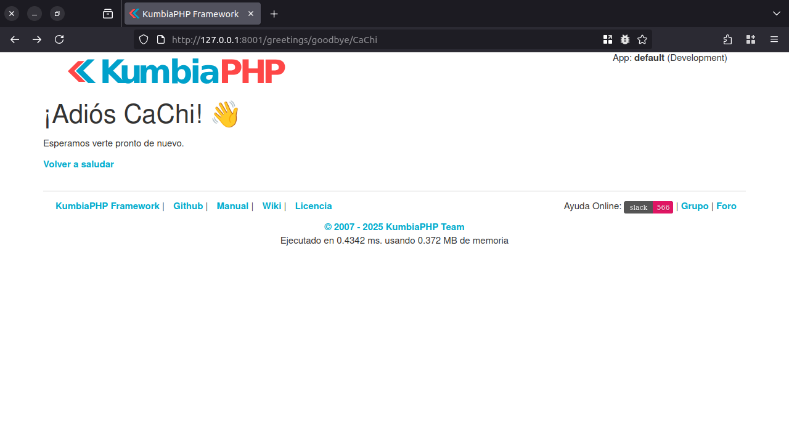

# My First Application with KumbiaPHP

After configuring KumbiaPHP and [viewing its welcome page](to-install.md), we will create a first example. Its goal is to
understand the basic elements needed to use the framework and, at the same time, understand the
**[MVC (Model-View-Controller)](mvc.md)** architecture.

## First Greeting with KumbiaPHP

In this example, we will create the classic "Hello World!" message, with one variation: we will say **"Hello KumbiaPHP!"**.
Let's recall how the MVC model works:

* KumbiaPHP receives a request.
* It looks for the specified **controller**.
* Within the controller, it locates the **action** that must handle the request.
* Finally, it uses that information to find the associated **view** and display the result.

## Creating the First Controller

Create a controller in `app/controllers/greetings_controller.php`:

```php
<?php
/**
 * Controller for greetings
 */
class GreetingsController extends AppController
{
    /**
     * Default greeting action
     *
     * @return void
     */
    public function hello()
    {
    }
}
```

This code defines the **GreetingsController** class.

* The `Controller` suffix indicates that this is a controller.
* It inherits from the **AppController** base class, which provides the features needed to handle requests.
* It includes the `hello()` method, which acts as the main action in this example.

## Designing the Associated View

To display what the controller sends, create the **associated view**.

1. Create a directory with the same name as the controller: `app/views/greetings/`.
2. Inside this directory, add a file named `hello.phtml`, since the defined action is called `hello()`.

View contents:

```html
<h1>Hello KumbiaPHP!</h1>
```

When accessing `http://127.0.0.1:8001/greetings/hello/`, the message will be displayed as shown in Figure 1.


*Figure 1: Contents of the hello.phtml view*

## KumbiaPHP and URLs

In KumbiaPHP, URLs indicate which controller and action should be executed. Thanks to its URL-rewriting system and the
use of a front controller, URLs are cleaner, easier to read, and friendlier to [SEO](https://en.wikipedia.org/wiki/Search_engine_optimization).

### Anatomy of a KumbiaPHP URL

In a typical URL, each segment has a meaning: the domain, the controller, the action, and, optionally, the parameters.


*Figure 2: KumbiaPHP URL*

In KumbiaPHP:

* `.php` extensions are not used because all requests are processed by the front controller.
* Additional URL segments are interpreted as arguments passed directly to the action method.

### URL Parameters

Any value that appears after the action name is considered a **parameter**. These parameters are passed as arguments to the
corresponding controller method.

Example:


*Figure 3: URL with parameters*

Instead of using traditional parameters such as `?var=value&var2=value2`—which are long and difficult to read—KumbiaPHP
provides **clearer and more organized URLs**. This avoids exposing internal system details and improves the user
experience and SEO.

## Making the Greeting More Dynamic

To make the greeting more dynamic, display the **current date and time**. Edit the controller:

```php
<?php
/**
 * Controller for greetings
 */
class GreetingsController extends AppController
{
    /**
     * Greeting action with date
     *
     * @return void
     */
    public function hello()
    {
        $this->date = date("Y-m-d H:i");
    }
}
```

In KumbiaPHP, all **public variables** defined in the controller are automatically passed to the view as available
variables. In this case, `$this->date` will be available in the view as `$date`.

Edit `app/views/greetings/hello.phtml`:

```php
<h1>Hello KumbiaPHP!</h1>
<?= $date ?>
```

Now, when visiting `http://127.0.0.1:8001/greetings/hello/` again, the current date and time will be displayed (Figure 4).


*Figure 4: Date and time of the request*

> 💡 **Note**: The short `<?= ?>` syntax is equivalent to `<?php echo ?>`, but it is more concise and readable when
> printing variables in views.

### Passing Parameters in the URL

We can improve the greeting further by asking the user for their name as a parameter. Modify the controller:

```php
<?php
/**
 * Controller for greetings
 */
class GreetingsController extends AppController
{
    /**
     * Greeting action with name and date
     *
     * @param string $name User name
     * @return void
     */
    public function hello($name)
    {
        $this->date = date("Y-m-d H:i");
        $this->name = $name;
    }
}
```

Edit the `hello.phtml` view:

```php
<h1>Hello <?= h($name) ?>, how nice it is to use KumbiaPHP! Right?</h1>
<p>Current date and time: <?= $date ?></p>
```

When visiting `http://127.0.0.1:8001/greetings/hello/CaChi/`, a personalized greeting and the current date will be
displayed (Figure 5).


*Figure 5: Greeting the user*

> 💡 **Note:** KumbiaPHP includes the `h()` function as a shortcut for `htmlspecialchars()`. Wrapping dynamic values in
> `h()` is recommended to help prevent security issues (XSS) and ensure that the application's charset is respected.

## Adding a New Action: goodbye()

So far, we have created the `hello()` action and its associated view. To complete the example, add a second action to the
same controller: `goodbye()`. This new action shows how to reuse the same logic we have learned (controller + view), but
this time to say goodbye instead of hello.

```php
<?php
/**
 * Controller for greetings
 */
class GreetingsController extends AppController
{
    /**
     * Greeting action with name and date
     *
     * @param string $name User name
     * @return void
     */
    public function hello($name)
    {
        $this->date = date("Y-m-d H:i");
        $this->name = $name;
    }

    /**
     * Farewell action
     *
     * @param string $name User name
     * @return void
     */
    public function goodbye($name)
    {
        $this->name = $name;
    }
}
```

Now create the `app/views/greetings/goodbye.phtml` view:

```php
<h1>Goodbye <?= h($name) ?>! 👋</h1>
<p>We hope to see you again soon.</p>
<?= Html::linkAction('hello/' . $name, 'Back to greeting') ?>
```

If we access `http://127.0.0.1:8001/greetings/goodbye/CaChi`, we will see the farewell message with a link to return to
the greeting (Figure 6).


*Figure 6: Farewell to the user*

The `Html::linkAction()` method is a **helper** that makes it easier to create links. Instead of writing the following
manually:

```html
<a href="/greetings/hello/CaChi/">Back to greeting</a>
```

...we use a cleaner and more maintainable approach. If we change the controller name, we will not have to update every link
manually.

With this first example, we have learned how to create a controller and its associated views in KumbiaPHP, how URLs are
structured, and how parameters are passed to actions. A simple greeting and farewell illustrate the MVC architecture,
the passing of variables to views, and the use of helpers that simplify the code. With these foundations, we are ready to
develop more complete applications with KumbiaPHP.
