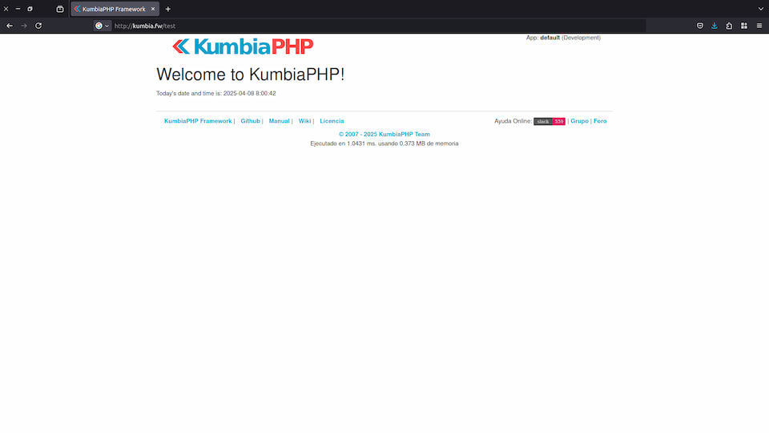

# Installing KumbiaPHP on Web Servers (Apache and Nginx) for GNU/Linux (Debian, Ubuntu and derivatives)

This section provides instructions for installing and configuring KumbiaPHP using **Apache** or **Nginx** as a web
server on Linux distributions such as Ubuntu and Debian. By the end, you will have a functional KumbiaPHP installation
ready for development.

> ⚠️ **Warning**
>
> This installation is intended as a testing environment, designed for experimenting with KumbiaPHP on a local server.
> It is **not** recommended for developing applications that will be deployed to production.

## Prerequisites

* A **Web Server** (Apache HTTP or Nginx) installed and running.
* **PHP 8.0** (or later) with required extensions: `php-mbstring`, `php-xml`, `php-json`, etc.
* Basic knowledge of terminal commands (`sudo`, moving files, etc.).

## Download and Extract KumbiaPHP

1. Go to the directory where the project files will be stored, e.g. `/var/www`:

   ```bash
   cd /var/www
   ```

2. **Download** the latest `.tar.gz` file from the official repository:

   ```bash
   wget https://github.com/KumbiaPHP/KumbiaPHP/archive/v1.2.1.tar.gz
   ```

3. **Extract** the contents:

   ```bash
   tar -xzvf v1.2.1.tar.gz
   ```

4. (Optional) **Rename** the resulting folder:

   ```bash
   mv KumbiaPHP-1.2.1 kumbiafw
   ```

## Server-Specific Configuration

### Apache

1. Create a new configuration file in `/etc/apache2/sites-available/`, for example `kumbiafw.conf`:

```apache
<VirtualHost *:80>
    ServerName kumbia.fw
    DocumentRoot /var/www/kumbiafw/default/public

    <Directory /var/www/kumbiafw/default/public>
        AllowOverride All
        Require all granted
    </Directory>
    
    ErrorLog ${APACHE_LOG_DIR}/kumbiafw-error.log
    CustomLog ${APACHE_LOG_DIR}/kumbiafw-access.log combined
</VirtualHost>
```

* Replace `kumbia.fw` with the local domain or hostname you want to use.
* Adjust the `DocumentRoot` path to match where you extracted KumbiaPHP.

2. Enable the new site and the `rewrite` module:

```bash
sudo a2ensite kumbiafw.conf
sudo a2enmod rewrite
sudo systemctl reload apache2
```

#### Why is `mod_rewrite` important?

`mod_rewrite` is an Apache module that allows rewriting user-friendly URLs.
KumbiaPHP leverages this feature to let you use clean, readable URLs, like those seen in modern applications (without
symbols such as `?`, `&`, or file extensions like `.php`, `.asp`, `.aspx`, etc.).

Additionally, `mod_rewrite` enhances application security by restricting direct access to internal directories and
files. Only the contents of the `public/` directory are accessible, ensuring business logic and core classes remain
protected.

It also improves search engine indexing, which benefits the visibility of your applications.

### Nginx

1. Create a new server block in `/etc/nginx/sites-available/kumbiafw`:

**Using `$_SERVER['PATH_INFO']`:**

```nginx
server {
    listen      80;
    server_name kumbia.fw;
    root        /var/www/kumbiafw/default/public;
    index       index.php index.html index.htm;

    location / {
        try_files $uri $uri/ /index.php$uri?$args;
    }

    location ~ \.php {
        # Extract PATH_INFO after index.php
        fastcgi_split_path_info ^(.+\.php)(/.*)$;

        fastcgi_pass 127.0.0.1:9000;
        # fastcgi_pass unix:/run/php/php-fpm.sock;

        include fastcgi_params;
        fastcgi_param SCRIPT_FILENAME $document_root$fastcgi_script_name;
        fastcgi_param PATH_INFO       $fastcgi_path_info;
    }

    location ~ /\.ht {
        deny all;
    }
}
```

**Using `$_GET['_url']`:**

```nginx
server {
    listen      80;
    server_name kumbia.fw;
    root        /var/www/kumbiafw/default/public;
    index       index.php index.html index.htm;

    location / {
        try_files $uri $uri/ /index.php?_url=$uri&$args;
    }

    location ~ \.php {
        fastcgi_pass 127.0.0.1:9000;
        # fastcgi_pass unix:/run/php/php-fpm.sock;

        include fastcgi_params;
        fastcgi_param SCRIPT_FILENAME $document_root$fastcgi_script_name;
    }

    location ~ /\.ht {
        deny all;
    }
}
```

* Update `server_name` and `root` as needed.
* Make sure the PHP-FPM socket corresponds to your PHP version.

> ℹ️ **Important**
> If you are using another PHP version (e.g. 8.1), adjust the socket path in Nginx (`fastcgi_pass`) or the corresponding
> module in Apache. Some instructions may vary slightly depending on your Ubuntu or Debian version.

2. Enable the new site:

```bash
sudo ln -s /etc/nginx/sites-available/kumbiafw /etc/nginx/sites-enabled/
sudo nginx -t
sudo systemctl reload nginx
```

## Set Permissions

Ensure that the web server user (usually `www-data`) has access to the files:

```bash
sudo chown -R www-data:www-data /var/www/kumbiafw
sudo find /var/www/kumbiafw -type d -exec chmod 755 {} \;
sudo find /var/www/kumbiafw -type f -exec chmod 644 {} \;
```

* Directories should have `755` permissions.
* Files should have `644` permissions.

## Test the Installation

1. Edit your `/etc/hosts` file to map the server name:

   ```bash
   sudo nano /etc/hosts
   ```

   Add this line:

   ```
   127.0.0.1   kumbia.fw
   ```

2. Open your browser and visit `http://kumbia.fw`. You should see the KumbiaPHP welcome page.


## Verification with a Controller and View

1. Create a file `app/controllers/test_controller.php`:

```php
<?php
/**
 * TestController is an example to demonstrate a basic setup in KumbiaPHP.
 */
class TestController extends AppController
{
    /**
     * Default action
     *
     * This action simply shows a welcome message.
     *
     * @return void
     */
    public function index()
    {
        $this->date = date('Y-m-d H:i:s');
    }
}
```

2. And its corresponding view in `app/views/test/index.phtml`:

```php
<h1>Welcome to KumbiaPHP!</h1>
Today's date and time is: <?= $date ?>
```

3. Visit `http://kumbia.fw/test` in your browser to see the welcome message.


