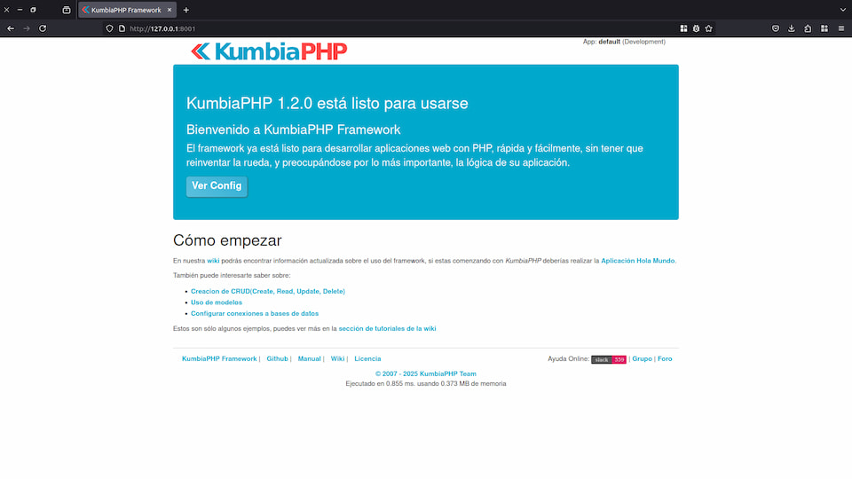

# Installing KumbiaPHP

This section explains the necessary steps to get the framework up and running in your development environment.

> ⚠️ **Warning**
>
> This installation is intended as a testing environment, designed for experimenting with KumbiaPHP on a local server.
> It is **not** recommended for developing applications that will be deployed to production.

## Requirements

As mentioned earlier, KumbiaPHP is very easy to use, and the requirements to run it are minimal. You only need a [**PHP
version 8.0**](https://www.php.net/) interpreter or higher.

## Installation Steps

1. Download the KumbiaPHP compressed file from the downloads section at
   [kumbiaphp.com](http://www.kumbiaphp.com/blog/manuales-y-descargas/) to get the latest version of the framework.

   Make sure the file has the `.tgz` extension if you are using Linux, or `.zip` if you are using Windows; otherwise, it
   may not decompress properly.

2. Once downloaded, extract its contents into your preferred directory.
   To keep this manual consistent, we will assume the package has been extracted into a directory named `kumbiaphp/`,
   with a structure similar to the following:

   ```
   kumbiaphp/
   ├── core/
   ├── vendor/
   └── default/
       ├── app/
       ├── public/
       │   ├── .htaccess
       │   └── index.php
       ├── .htaccess
       └── index.php
   ```

3. Open a terminal and navigate to the `default/app` directory:

   ```bash
   cd kumbiaphp/default/app
   ```

4. Run the included development server:

   ```bash
   ./bin/phpserver
   ```

   This command starts a local web server using PHP’s built-in server, allowing you to run the application immediately
   without additional configuration.

5. Open your web browser and go to:

   ```
   http://0.0.0.0:8001/
   ```

   or

   ```
   http://127.0.0.1:8001/
   ```

   If everything went well, you should see a welcome page indicating that the installation was successful.

   

> ℹ️ **Information**
>
> **Alternative: Using Apache or Nginx** — If you prefer, you can use a traditional web server such as Apache or Nginx.
> For that, refer to the section
> [Installing KumbiaPHP on Web Servers (Apache and Nginx)](installing-kumbiaphp-apache-nginx.md), where you will find
> detailed instructions.

## Application Modes

KumbiaPHP offers two execution modes for an application, defined in the
[default/public/index.php](https://github.com/KumbiaPHP/KumbiaPHP/blob/master/default/public/index.php) file:

### Development Mode

This is the default mode. The `PRODUCTION` constant is set to `false`:

```php
const PRODUCTION = false;
```

In this mode, KumbiaPHP’s cache is disabled. Any changes made to database tables or fields, as well as to views, are
reflected immediately.

### Production Mode

To enable it, change the `PRODUCTION` constant to `true`:

```php
const PRODUCTION = true;
```

In this mode, KumbiaPHP enables its caching system, storing key information such as database metadata (table names,
fields, etc.) and any views you choose to cache, improving performance.

> ⚠️ **Warning**
>
> When changing `PRODUCTION` from `false` to `true`, you must manually delete the contents of the cache directory
> located at `default/app/temp/cache/` to ensure that metadata is refreshed correctly. If you don’t, you may encounter
> errors when saving or displaying information.
