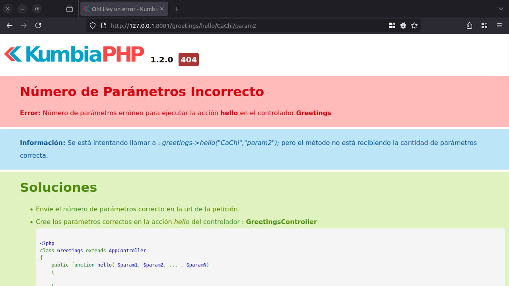
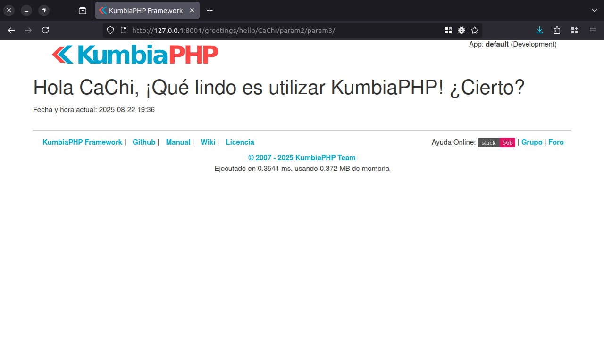
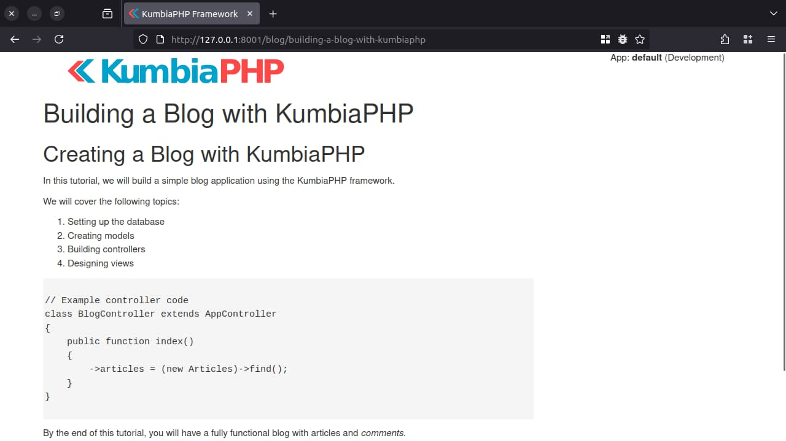

# El Controlador

En **KumbiaPHP Framework**, la *capa del controlador* es el puente que conecta la lógica de negocio con la presentación.
Se compone de varios elementos clave:

* **Acciones**: verifican la integridad de las peticiones y preparan los datos que la vista necesita.
* **Clases auxiliares (`Input`, `Session`, etc.)**: facilitan el acceso a parámetros de la petición y a datos
  persistentes del usuario.
* **Filtros**: fragmentos de código que se ejecutan antes y/o después de un controlador o de una acción para realizar
  validaciones, aplicar reglas de seguridad, modificar la respuesta, etc.

En una página sencilla, bastará con un par de líneas en la acción que corresponda. El resto de componentes se usan
cuando el escenario lo requiere.

## Las Acciones

Las acciones constituyen el flujo básico de la aplicación: reciben la petición, interactúan con el modelo y definen
variables para la vista. Cuando llega una URL, KumbiaPHP determina qué acción ejecutar y qué parámetros entregar.
Consulta la sección [KumbiaPHP y sus URLs](first-app.md#kumbiaphp-y-sus-urls) para más detalles.

Las acciones son métodos dentro de un *ClassController* que hereda de **`AppController`**; estos controladores pueden
estar organizados o no en módulos.

### Acciones y vistas

Por convención, al terminar una acción KumbiaPHP busca una vista con el mismo nombre. Si existe una acción `hello()`,
debe existir una vista `hello.phtml`. (En capítulos posteriores profundizaremos en el sistema de vistas).

### Obtener valores desde una acción

Las URL de KumbiaPHP siguen una estructura predecible. Desde el controlador puedes acceder a los valores recibidos
mediante propiedades públicas:

* `controller_name`
* `action_name`
* `parameters`

Ejemplo con la URL `http://127.0.0.1:8001/news/show/12/`:

```php
<?php
/**
 * Controlador para noticias
 */
class NewsController extends AppController
{
    /**
     * Muesta la noticia solicitada
     *
     * @param int $id Identificador del artículo
     */
    public function show(int $id): void
    {
        $this->controller_name; // news
        $this->action_name;     // show
        $this->parameters;      // Arreglo con todos los parámetro enviados a la acción
    }
}
```

### Validación automática del número de parámetros

KumbiaPHP impide, por defecto, que se pasen más parámetros de los declarados en la firma del método. Si se invoca
`show()` sin `$id` o con parámetros extra, el framework lanzará una excepción (en producción retornará *404*).

#### Ejemplo de excepción por número de parámetros

```php
<?php
/**
 * Controlador para saludar – Parámetros estrictos
 */
class GreetingController extends AppController
{
    /**
     * Acción para saludar
     *
     * @return void
     */
    public function hello($name)
    {
        $this->name = $name;
        $this->date = date("Y-m-d H:i");
    }
}
```

Si accedes a `http://127.0.0.1:8001/greeting/hello/CaChi/param2/`, KumbiaPHP mostrará una excepción como la siguiente:



#### Permitir parámetros adicionales con `$limit_params`

Para omitir la restricción de cantidad de parámetros en una acción (o en todo el controlador), declara la propiedad
º`$limit_params` en **`false`**:

```php
<?php
/**
 * Controlador para saludar – Parámetros flexibles
 */
class GreetingController extends AppController
{
    /**
     * @var bool Ignora el número exacto de parámetros para todas las acciones en este controladoractions in this controller.
     */
    public $limit_params = false;

    /**
     * Acción para saludar
     *
     * @return void
     */
    public function hello($name)
    {
        $this->name = $name;
        $this->date = date("Y-m-d H:i");
    }
}
```

Prueba la URL `http://127.0.0.1:8001/greeting/hello/CaChi/param2/param3/`: verás la vista renderizada sin errores.



## Convenciones y creación de un Controlador

### Convenciones

* Los controladores se guardan en **`app/controllers/`**.
* El archivo termina en `_controller.php` (`greeting_controller.php`).
* El nombre de la clase sigue la notación *CamelCase* (`GreetingController`).

### Creación de un Controlador mínimo

```php
<?php
/**
 * Controlador para saludar
 */
class GreetingController extends AppController
{
}
```

### Clase AppController

`AppController` es la superclase de la que heredan todos los controladores. Se encuentra en
`app/libs/app_controller.php` y concentra utilidades comunes (filtros, helpers, acceso a la capa de vista, etc.).

### Clase AdminController

`AdminController` amplía la idea de un punto de entrada común, pero dirigido a secciones protegidas del sitio (paneles
de administración, *back‑office*, etc.). Cualquier controlador administrativo debe extender esta clase para heredar
reglas de autenticación y autorización unificadas.

> **Nota:** Próximas versiones del framework incluirán una implementación básica de autenticación para esta clase.

## Filtros

Los filtros permiten ejecutar lógica adicional antes o después de un controlador o de una acción. Son especialmente
útiles para validar solicitudes AJAX, cambiar el formato de la respuesta, limpiar datos de sesión, etc.

### Filtros de Controlador

Se ejecutan antes y después de un **controlador completo**.
Ejemplos de uso: validar acceso a un módulo, verificar sesiones de usuario, bloquear controladores no autorizados.

* **initialize()**: se ejecuta antes de cargar el controlador.
* **finalize()**: se ejecuta después de procesar el controlador.

Ambos métodos se sobrescriben en `AppController`.

### Filtros de Acción

Se ejecutan antes y después de una **acción específica**.

* **before\_filter()**: se ejecuta antes de la acción. Útil para validar si la petición es AJAX, entre otros.
* **after\_filter()**: se ejecuta después de la acción. Se usa, por ejemplo, para modificar variables de sesión.

## Acciones y controladores por defecto

En **KumbiaPHP** si la URL no especifica controlador ni acción, el *dispatcher* invoca por defecto al
**`IndexController`** y a la acción **`index`**.
Pero, ¿qué sucede cuando la URL *sí* indica un controlador existente y, a su vez, una **acción que no está declarada**
en él?
Por defecto el framework lanzaría un error *404*, pero podemos interceptar esta situación y ofrecer un comportamiento
más flexible mediante el método mágico **`__call()`** de PHP.

`__call()` se ejecuta automáticamente cuando se invoca un método inexistente o no accesible sobre un objeto.
Al sobrescribirlo en un controlador, obtenemos la oportunidad de decidir qué hacer antes de que KumbiaPHP entregue un
error al usuario.
Esto abre varias posibilidades, por ejemplo:

* Renderizar **vistas estáticas** sin crear acciones vacías.
* Servir **páginas dinámicas** almacenadas en base de datos basándose en un *slug* presente en la URL.
* Personalizar el manejo de errores 404 manteniendo la lógica dentro del propio controlador.

A continuación se muestran dos patrones frecuentes que aprovechan `__call()` en proyectos reales.

### Controladores con `__call()` para vistas dinámicas

Un escenario típico es el de un sitio de ayuda o documentación donde cada página corresponde a un archivo `.phtml`
dentro de `app/views/pages/`.
En lugar de definir docenas de métodos vacíos en un controlador, podemos cargar la vista que coincida con la acción
solicitada. Un gran ejemplo de esto ya se encuentra disponible por defecto dentro de KumbiaPHP

```php
<?php
class PagesController extends AppController
{
    protected function before_filter()
    {
        // Si es AJAX enviar solo el view
        if (Input::isAjax()) {
            View::template(null);
        }
    }

    public function __call($name, $params)
    {
        View::select(implode('/', [$name, ...$params]));
    }
}
```

Con este controlador, añadir una nueva página de ayuda implica únicamente crear su vista en `app/views/pages/`.
Por ejemplo, la URL `/pages/faq` intentará cargar `pages/faq.phtml`.
Si la vista no existe, se mostrará una vista con el error 404 Página no encontrada.

### Controladores con `__call()` para páginas dinámicas desde base de datos

Otro caso común es el de un pequeño CMS donde las páginas se identifican por un **slug** almacenado en la base de datos.
El controlador captura el slug, busca el registro con ActiveRecord y muestra el contenido usando una vista genérica.

```php
<?php
/**
 * Sirve páginas con contenido dinámico del blog.
 */
class BlogController extends AppController
{
    /**
     * Encuentra el artículo por su slug y muestra la vista correspondiente.
     *
     * @param string $slug  Slug de la entrada del blog
     * @param array  $args  Parámetros adicionales (no utilizados)
     *
     * @return void
     */
    public function __call($name, $args)
    {
        $this->slugShow($name, $args);
    }

    /**
     * Muestra la lista de artículos del blog.
     *
     * @return void
     */
    public function index(): void
    {
        $this->articles = (new Articles)->all();
    }

    /**
     * Encuentra el artículo por su slug y muestra la vista correspondiente.
     *
     * @param string $slug  Slug de la entrada del blog
     * @param array  $args  Parámetros adicionales (no utilizados)
     *
     * @return void
     */
    private function slugShow(string $slug, array $args): void
    {
        $this->article = (new Articles)->getBySlug($slug);

        View::select('slugShow');
    }
}
```

#### Vista genérica `app/views/blog/slugShow.phtml`

```php
if (!$article) {
    View::partial('articles/404');
    return 1;
}

<h1><?= h($article->title) ?></h1>
<div class="content">
    <?= strip_tags($article->content, '<p><br><h1><h2><ul><ol><li><em><b><a><blockquote><code><pre>') ?>
</div>
```

Con esta configuración, cualquier URL `/blog/<slug>` funciona sin crear métodos adicionales:

* `/blog/buscador-avanzado-texto-completo-kumbiaphp-meilisearch` → busca 
  `slug = 'buscador-avanzado-texto-completo-kumbiaphp-meilisearch'` en la tabla **articles** y muestra el contenido.
* `/blog/optimizando-la-renderizacion-condicional-en-vistas-de-kumbiaphp-con-return-1` → idéntico flujo con un solo
  archivo de vista.



Si la página no existe, el mismo controlador mostrará un mensaje y podrá devolver un 404 personalizado.

Con estos patrones, `__call()` se convierte en una herramienta poderosa para mantener controladores delgados y flexibles
dentro de la arquitectura MVC de KumbiaPHP, evitando duplicación de código y mejorando la capacidad de extensión del
proyecto.
