# CRUD de menús con KumbiaPHP

En este tutorial construirás un CRUD pequeño para la tabla `menus`. El ejemplo
usa las convenciones de KumbiaPHP y `ActiveRecord`: no necesita un Scaffold ni
modifica el comportamiento del framework.

> **Alcance del ejemplo**
>
> El código sirve para aprender el flujo MVC y las operaciones básicas de
> persistencia. No es una implementación completa de autenticación,
> autorización ni protección CSRF. En particular, `del($id)` se conserva como
> una acción educativa invocada desde un enlace; antes de usar un flujo similar
> en producción, define las protecciones apropiadas para tu aplicación.

## Objetivos

Al terminar podrás:

- relacionar una tabla `menus` con un modelo `Menus`;
- recibir peticiones en las acciones `index`, `create`, `edit` y `del`;
- mostrar datos y mensajes en vistas `.phtml`;
- crear, listar, editar, eliminar y paginar registros;
- seguir el recorrido de una URL desde el front controller hasta la vista.

## Prerrequisitos

Necesitas:

1. Una aplicación KumbiaPHP que puedas ejecutar en tu entorno.
2. Acceso a una base de datos y permiso para crear la tabla del ejemplo.
3. Conocimientos básicos de PHP, SQL y edición de archivos.
4. Una conexión configurada para el entorno que utilizarás. No copies
 credenciales de ejemplos: usa los valores de tu instalación.

Si necesitas preparar la conexión, consulta primero
[Configurando conexión a la base de datos](active-record.md#configurando-conexión-a-la-base-de-datos).
La plantilla actual utiliza `databases.php`; el manual también documenta
`databases.ini` como compatibilidad heredada.

## Resultado final

Al completar los pasos tendrás:

- una lista de menús ordenada por `id` descendente;
- un formulario para agregar un menú;
- un formulario para editar un menú existente;
- enlaces para editar o borrar cada registro;
- navegación anterior/siguiente cuando existan varias páginas.

Las rutas relativas del ejemplo son:


| Ruta              | Resultado esperado                                            |
| ----------------- | ------------------------------------------------------------- |
| `/menus/`         | Lista la primera página; `index` es la acción predeterminada. |
| `/menus/index/2/` | Lista la página 2.                                            |
| `/menus/create/`  | Muestra y procesa el formulario de creación.                  |
| `/menus/edit/ID/` | Muestra y procesa la edición del registro `ID`.               |
| `/menus/del/ID/`  | Ejecuta el borrado educativo del registro `ID`.               |


Sustituye el prefijo por la URL pública de tu aplicación. No se presupone un
dominio, un puerto ni un subdirectorio concretos.

## Panorama: CRUD y MVC

CRUD resume cuatro operaciones sobre los datos:


| Operación | Acción del controlador | Operación de `ActiveRecord` | Qué observa la persona usuaria           |
| --------- | ---------------------- | --------------------------- | ---------------------------------------- |
| Create    | `create`               | `create()`                  | Un formulario y un mensaje de resultado. |
| Read      | `index`                | `paginate()`                | Una lista de menús y sus enlaces.        |
| Update    | `edit`                 | `update()`                  | Un formulario con los valores actuales.  |
| Delete    | `del`                  | `delete()`                  | La lista sin el registro borrado.        |


En KumbiaPHP, el flujo MVC de este ejemplo es:

1. El front controller recibe la URL y el enrutamiento identifica el
 controlador, la acción y sus parámetros.
2. `MenusController` recibe la petición y llama a `Menus` cuando necesita leer
 o modificar datos.
3. La acción asigna atributos públicos, como `$this->listMenus`.
4. KumbiaPHP carga la vista que coincide con el nombre de la acción y esta
 genera la respuesta HTML.

Para una explicación general, consulta [Modelo, Vista, Controlador
(MVC)](mvc.md#modelo,-vista,-controlador-mvc). Este tutorial solo añade el
recorrido concreto del CRUD.

## Estructura de archivos

En las rutas siguientes, `[app]` representa el directorio de la aplicación. En
la plantilla versionada en este checkout corresponde a `framework/default/app/`;
en tu instalación puede tener otra ubicación.

```text
[app]/
├── config/
│   ├── databases.php
│   └── routes.php       # opcional; este ejemplo usa las convenciones
├── models/
│   └── menus.php
├── controllers/
│   └── menus_controller.php
└── views/
    └── menus/
        ├── index.phtml
        ├── create.phtml
        └── edit.phtml
```

El archivo `routes.php` es opcional para este caso: las rutas anteriores siguen
la convención `controlador/acción/parámetros`. Solo necesitarías una ruta
personalizada si tu aplicación decide cambiar ese esquema.


*Archivos que componen el CRUD de menús.*

## Paso 1: preparar la base de datos

### 1.1 Configura la conexión

Abre `[app]/config/databases.php` y completa la conexión del entorno que uses
con los datos de tu instalación. La plantilla actual define la conexión
`development` en un array; revisa los nombres de las claves y los motores
admitidos en [Configurando conexión a la base de datos](active-record.md#configurando-conexión-a-la-base-de-datos).

No incluyas contraseñas reales en el tutorial, en capturas ni en el control de
versiones. El archivo de configuración solo indica cómo conecta tu aplicación;
la tabla debe crearse en esa misma base de datos.

### 1.2 Crea `menus`

Ejecuta el siguiente bloque en el cliente de base de datos que corresponda a
tu entorno:

```sql
CREATE TABLE menus
(
    id     INT          NOT NULL AUTO_INCREMENT,
    nombre VARCHAR(100),
    titulo VARCHAR(100) NOT NULL,
    PRIMARY KEY (id)
);
```

Este SQL es específico de **MySQL** porque utiliza `AUTO_INCREMENT`. Si usas
otro motor, adapta la definición de la clave autoincremental según su sintaxis;
no asumas que este bloque funciona sin cambios.

La convención del modelo hará que `Menus` use la tabla `menus`. `id` es la
clave primaria, `titulo` es obligatorio y `nombre` puede quedar vacío en esta
versión educativa.


*Tabla `menus` creada en la base de datos del entorno de desarrollo.*

## Paso 2: crear el modelo

### 2.1 Crea el archivo

Crea `[app]/models/menus.php` con este contenido:

```php
<?php

class Menus extends ActiveRecord
{
    public function getMenus($page, $perPage = 20)
    {
        return $this->paginate(
            "page: $page",
            "per_page: $perPage",
            'order: id desc'
        );
    }
}
```

En la configuración actual, `ActiveRecord` se carga automáticamente. El
constructor del modelo también acepta un array de datos; el controlador lo
utilizará para crear un registro a partir del formulario.

`getMenus()` delega la consulta y la paginación en `ActiveRecord`. El objeto
devuelto por `paginate()` contiene, entre otros, `items`, `prev`, `next`,
`current`, `total`, `count` y `per_page`. Consulta [ActiveRecord](active-record.md#activerecord)
y [Paginando en ActiveRecord](active-record.md#paginando-en-activerecord) para
la referencia completa, sin repetirla aquí.


*Modelo `Menus` con la consulta paginada del ejemplo.*

## Paso 3: crear el controlador

### 3.1 Implementa las cuatro acciones

Crea `[app]/controllers/menus_controller.php`:

```php
<?php

class MenusController extends AppController
{
    public function index($page = 1)
    {
        $page = max(1, (int) $page);
        $this->listMenus = (new Menus)->getMenus($page);
    }

    public function create()
    {
        if (Input::hasPost('menus')) {
            $menu = new Menus(Input::post('menus'));

            if ($menu->create()) {
                Flash::valid('Operación exitosa');
                Input::delete();
                return;
            }

            Flash::error('No se pudo crear el menú.');
        }
    }

    public function edit($id)
    {
        $menu = new Menus();

        if (Input::hasPost('menus')) {
            if ($menu->update(Input::post('menus'))) {
                Flash::valid('Operación exitosa');
                return Redirect::to();
            }

            Flash::error('No se pudo actualizar el menú.');
            return;
        }

        $this->menus = $menu->find_by_id((int) $id);
    }

    public function del($id)
    {
        if ((new Menus)->delete((int) $id)) {
            Flash::valid('Operación exitosa');
        } else {
            Flash::error('No se pudo eliminar el menú.');
        }

        return Redirect::to();
    }
}
```

### 3.2 Qué hace cada acción

- `index($page)` normaliza el número de página, llama a `getMenus()` y expone
el resultado como `$listMenus` para `index.phtml`.
- `create()` detecta el grupo `menus` del `POST`, construye `Menus` con ese
array y llama a `create()`. Tras guardar, limpia el `POST` y permanece en la
acción; no redirige en este ejemplo.
- `edit($id)` carga el registro en una petición inicial. Al recibir el
formulario, `update()` usa el `id` enviado y, si tiene éxito, redirige al
controlador actual mediante `Redirect::to()`.
- `del($id)` convierte el parámetro de la URL a entero, llama a `delete()` y
redirige al controlador actual.

Las acciones se convierten en vistas con el mismo nombre por convención. Para
ampliar esta parte, consulta [Acciones y vistas](controller.md#acciones-y-vistas)
y [Convenciones y creación de un Controlador](controller.md#convenciones-y-creación-de-un-controlador).
La referencia de las operaciones está en [create()](active-record.md#create),
[update()](active-record.md#update) y [delete()](active-record.md#delete).

## Paso 4: crear las vistas

KumbiaPHP busca estas vistas dentro de `[app]/views/menus/` porque el
controlador se llama `MenusController`. [Pasando datos a la vista](view.md#pasando-datos-a-la-vista)
explica por qué `$this->listMenus` llega como `$listMenus`; [Buffer de salida](view.md#buffer-de-salida)
explica el papel de `View::content()`.

### 4.1 Lista: `index.phtml`

Crea `[app]/views/menus/index.phtml`:

```php
<div class="content">
    <?php View::content() ?>

    <h3>Menús</h3>

    <p><?= Html::linkAction('create/', 'Agregar menú') ?></p>

    <?php if ($listMenus->items): ?>
        <ul>
        <?php foreach ($listMenus->items as $item): ?>
            <li>
                <?= Html::linkAction('edit/' . (int) $item->id . '/', 'Editar') ?>
                <?= Html::linkAction('del/' . (int) $item->id . '/', 'Borrar') ?>
                <strong><?= h((string) $item->nombre) ?> - <?= h((string) $item->titulo) ?></strong>
            </li>
        <?php endforeach ?>
        </ul>
    <?php else: ?>
        <p>No hay menús para mostrar.</p>
    <?php endif ?>

    <p>
        Página <?= (int) $listMenus->current ?>
        de <?= (int) $listMenus->total ?>
    </p>

    <nav aria-label="Paginación">
        <?php if ($listMenus->prev): ?>
            <?= Html::linkAction('index/' . (int) $listMenus->prev . '/', '<< Anterior') ?>
        <?php endif ?>

        <?php if ($listMenus->next): ?>
            <?= Html::linkAction('index/' . (int) $listMenus->next . '/', 'Siguiente >>') ?>
        <?php endif ?>
    </nav>
</div>
```

`Html::linkAction()` crea enlaces hacia otra acción del controlador actual.
Los identificadores usados en las rutas se convierten a entero y los valores
de la tabla se escapan con `h()` antes de insertarlos en HTML. `h()` protege el
contexto HTML; no sustituye la validación ni parametrización de consultas SQL.

### 4.2 Creación: `create.phtml`

Crea `[app]/views/menus/create.phtml`:

```php
<?php View::content() ?>

<h3>Crear menú</h3>

<?= Form::open() ?>

<label for="menus_nombre">Nombre</label>
<?= Form::text('menus.nombre') ?>

<label for="menus_titulo">Título</label>
<?= Form::text('menus.titulo') ?>

<?= Form::submit('Agregar') ?>
<?= Form::close() ?>
```

`Form::open()` usa por defecto la acción actual y el método `POST`; por eso el
formulario vuelve a `create()`. La notación `menus.nombre` genera un campo con
nombre `menus[nombre]`, que `Input::post('menus')` puede entregar al modelo.

### 4.3 Edición: `edit.phtml`

Crea `[app]/views/menus/edit.phtml`:

```php
<?php View::content() ?>

<h3>Editar menú</h3>

<?= Form::open() ?>

<label for="menus_nombre">Nombre</label>
<?= Form::text('menus.nombre') ?>

<label for="menus_titulo">Título</label>
<?= Form::text('menus.titulo') ?>

<?= Form::hidden('menus.id') ?>
<?= Form::submit('Actualizar') ?>
<?= Form::close() ?>
```

En una petición `GET`, el controlador asigna el registro a `$this->menus` y
los helpers del formulario toman de allí los valores iniciales. El campo oculto
conserva el identificador para que `update()` sepa qué registro actualizar.
Consulta [Clase Form](view.md#clase-form) y sus referencias de
[Form::open()](view.md#form::open), [Form::text()](view.md#form::text),
[Form::hidden()](view.md#form::hidden), [Form::submit()](view.md#form::submit)
y [Form::close()](view.md#form::close) si necesitas más opciones.

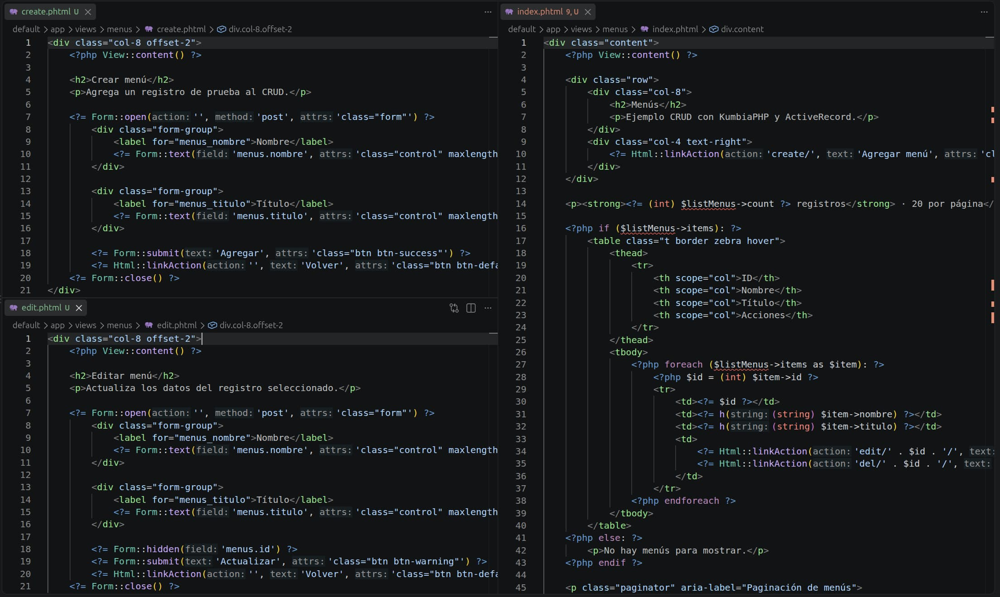

*Vistas de lista, creación y edición asociadas a las acciones del controlador.*

## Paso 5: comprobar las rutas

No necesitas agregar una ruta personalizada para este ejemplo. El front
controller recibe la petición y el router separa controlador, acción y
parámetros. Para profundizar, consulta [Cómo funcionan las URLs en
KumbiaPHP](first-app.md#cómo-funcionan-las-urls-en-kumbiaphp) y
[Destripando el Front Controller](front-controller.md#destripando-el-front-controller).

Prueba las rutas en este orden:

1. `/menus/` para abrir la lista inicial.
2. `/menus/create/` para abrir el formulario de creación.
3. Desde la lista, usa `Editar` para abrir `/menus/edit/ID/`.
4. Desde la lista, usa `Borrar` para ejecutar `/menus/del/ID/`.
5. Si hay más de 20 registros, abre `/menus/index/2/` o usa `Siguiente >>`.

`Html::linkAction()` genera los enlaces relativos al controlador actual, por lo
que no hace falta repetir el nombre `menus` en cada llamada.

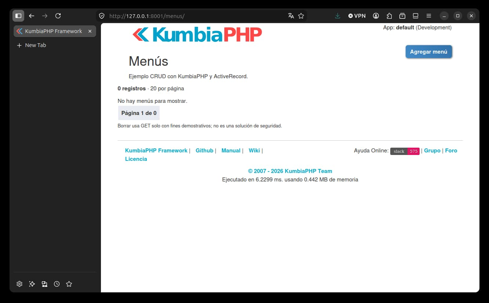

*La acción `index` muestra la lista inicial del CRUD.*


## Flujo de una petición y de los datos

### Listar

Para `/menus/index/2/` ocurre lo siguiente:

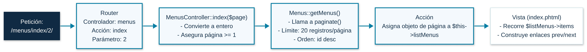

*Flujo de la petición que lista los menús y prepara la página de resultados.*

1. El router interpreta `menus` como controlador, `index` como acción y `2`
 como parámetro.
2. `MenusController::index($page)` convierte el parámetro a entero y evita una
 página menor que 1.
3. `Menus::getMenus()` llama a `paginate()` con 20 registros por página y
 orden `id desc`.
4. La acción asigna el objeto página a `$this->listMenus`.
5. `index.phtml` recorre `$listMenus->items` y usa `prev`/`next` para construir los enlaces.

### Crear

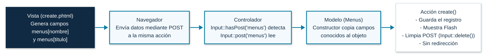

*Flujo de la petición que recibe el formulario y crea un menú.*

1. `create.phtml` genera campos `menus[nombre]` y `menus[titulo]`.
2. El navegador envía esos campos mediante `POST` a la misma acción.
3. `Input::hasPost('menus')` detecta el grupo y `Input::post('menus')` lo lee.
4. El constructor de `Menus` copia los campos conocidos al objeto.
5. `create()` guarda el registro, muestra un `Flash` y limpia el `POST` con
 `Input::delete()`. La acción no redirige después de guardar.

### Editar

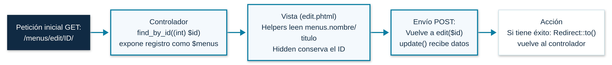

*Flujo de la petición que carga y actualiza un menú existente.*

1. La URL contiene el identificador: `/menus/edit/ID/`.
2. En la petición inicial, `find_by_id((int) $id)` carga el registro y lo
 expone como `$menus`.
3. Los helpers `Form::text()` leen `menus.nombre` y `menus.titulo` desde ese
 objeto; `Form::hidden('menus.id')` conserva el `id`.
4. El `POST` vuelve a `edit($id)` y `update()` recibe los datos del grupo
 `menus`.
5. Si la actualización tiene éxito, `Redirect::to()` vuelve al controlador
 actual.

### Eliminar

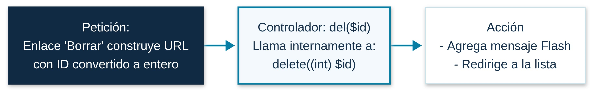

*Flujo de la petición que elimina el menú seleccionado y vuelve a la lista.*

1. El enlace `Borrar` construye una URL con el identificador convertido a
 entero.
2. `del($id)` llama a `delete((int) $id)`.
3. La acción agrega un mensaje `Flash` y redirige a la lista.

Este flujo explica el ejemplo, pero no añade autorización, confirmación,
protección CSRF ni una política de permisos. El enlace GET de borrado no debe
considerarse un límite de seguridad.

## Paso 6: verificar los resultados observables

Realiza las comprobaciones siguientes. Usa valores de prueba que no contengan
información sensible.

### 6.1 Listar

1. Abre `/menus/`.
2. Comprueba que aparece el título **Menús**, el enlace **Agregar menú** y una
 fila por cada registro.
3. Comprueba que cada fila muestra `nombre - titulo`, además de **Editar** y
 **Borrar**.
4. Si no hay registros, debe aparecer **No hay menús para mostrar**.

La vista imprime los valores dinámicos con `h()`, por lo que caracteres como
`<`, `>` y `&` deben mostrarse como texto y no interpretarse como HTML.

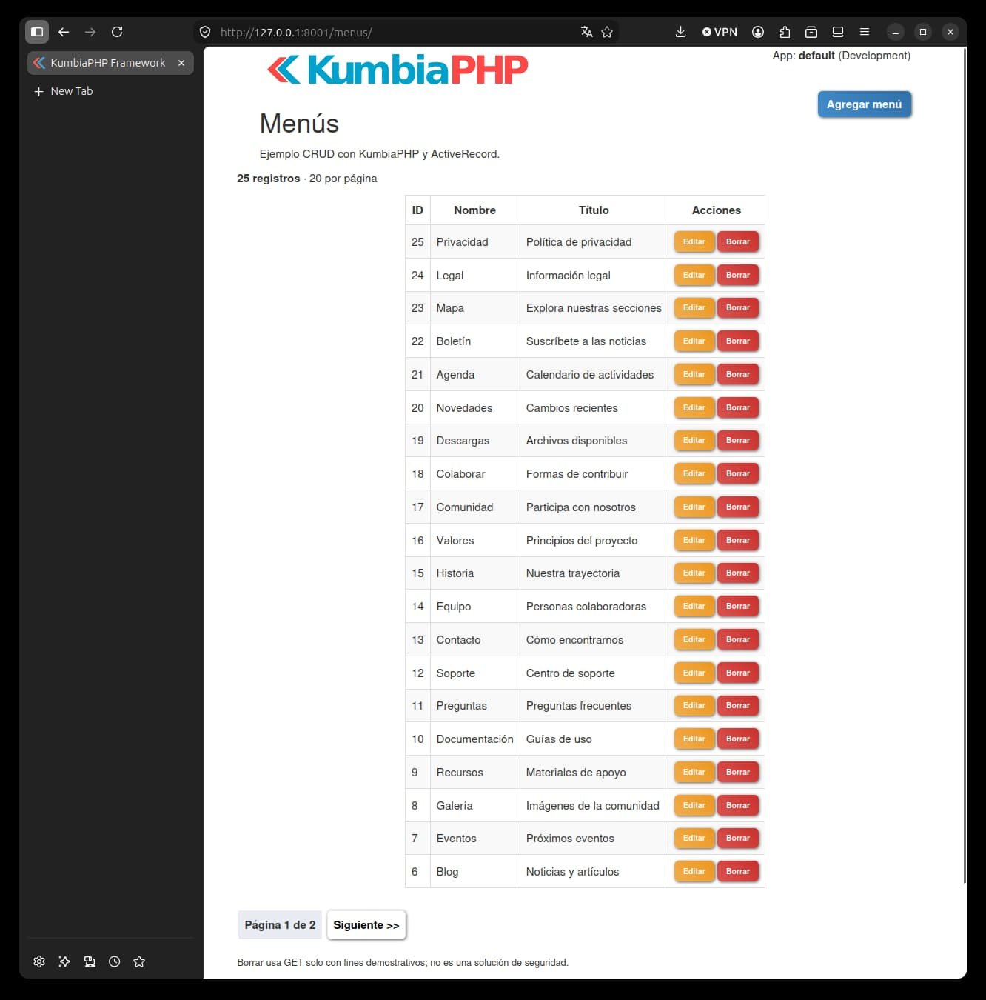

*La acción `index` muestra los registros y las operaciones disponibles.*

### 6.2 Crear

1. Abre `/menus/create/`.
2. Escribe un nombre y un título de prueba.
3. Pulsa **Agregar**.
4. Comprueba el mensaje **Operación exitosa** y que la acción permanece en la
 vista de creación; el ejemplo no redirige automáticamente.
5. Vuelve a `/menus/` y confirma que el nuevo registro aparece en la lista.

Si el guardado falla, la acción muestra **No se pudo crear el menú.**. Revisa
la conexión, la tabla y las restricciones de la base de datos antes de cambiar
el código.

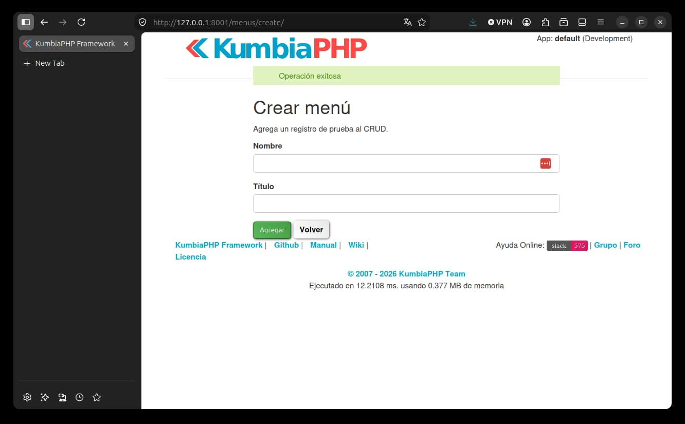

*La acción `create` informa el resultado y conserva la vista del formulario.*

### 6.3 Editar

1. Desde `/menus/`, pulsa **Editar** en un registro.
2. Comprueba que los campos muestran sus valores actuales.
3. Cambia el nombre o el título y pulsa **Actualizar**.
4. Comprueba el mensaje **Operación exitosa**, la redirección a la lista y el
 valor actualizado.

  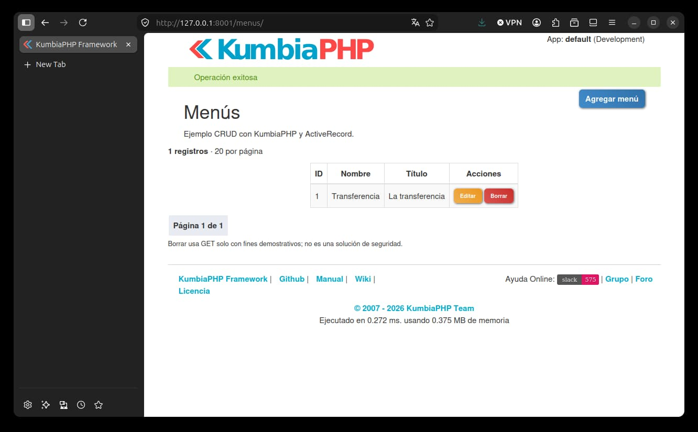

 *La acción `edit` actualiza un registro y vuelve a la lista.*

### 6.4 Eliminar

1. Identifica un registro de prueba que puedas borrar.
2. Pulsa **Borrar**.
3. Comprueba el mensaje **Operación exitosa**, la redirección a la lista y la
 ausencia del registro.

Recuerda que este enlace ejecuta una acción GET porque así está construido el
ejemplo. No lo uses como diseño de seguridad para una aplicación real.

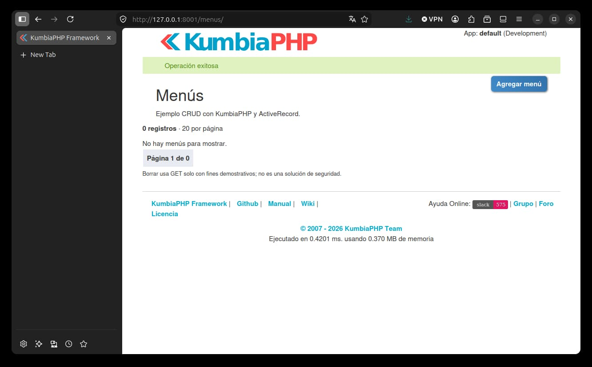

*La acción educativa `del` elimina el registro seleccionado y vuelve a la lista.*

### 6.5 Paginar

1. Crea o carga más de 20 registros de prueba; el modelo solicita 20 por
 página.
2. Abre `/menus/` y comprueba que aparece **Siguiente &gt;&gt;**.
3. Avanza a la página siguiente y comprueba que aparece **&lt;&lt; Anterior**.
4. Comprueba que el texto de página muestra el valor actual y el total de
 páginas.

El resultado de `paginate()` también informa `count` y `per_page`, aunque esta
vista solo muestra `current`, `total`, `prev`, `next` e `items`. Para usar
controles ya preparados, consulta [Partials de paginación](appendix.md#partials-de-paginación);
allí se documentan los partials `classic` y `digg` sin cambiar la consulta del
modelo.

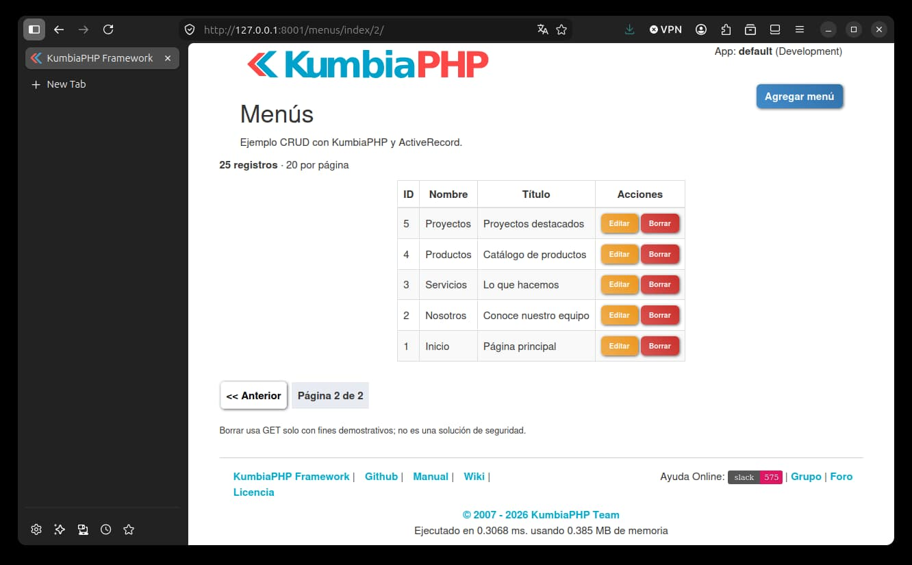

*El objeto página permite navegar entre los resultados de `paginate()`.*

## Errores comunes


| Síntoma                                         | Qué revisar                                                                                                                          |
| ----------------------------------------------- | ------------------------------------------------------------------------------------------------------------------------------------ |
| La tabla `menus` no existe o la conexión falla. | `[app]/config/databases.php`, el entorno seleccionado y que el SQL se ejecutó en esa misma base de datos.                            |
| `Class Menus not found`.                        | Que el archivo sea `[app]/models/menus.php`, que la clase sea `Menus` y que la aplicación esté ejecutándose con la autocarga actual. |
| La URL devuelve 404 para `menus`.               | Que el archivo termine en `_controller.php`, que la clase sea `MenusController` y que la ruta use el controlador `menus`.            |
| `index.phtml` no recibe `$listMenus`.           | Que la acción `index()` asigne `$this->listMenus` y que la vista esté en `[app]/views/menus/index.phtml`.                            |
| El formulario no llega al controlador.          | Que `Form::open()` y `Form::close()` estén completos y que los campos usen `menus.nombre` y `menus.titulo`.                          |
| La edición no identifica el registro.           | Que exista `Form::hidden('menus.id')`, que la tabla tenga `id` como clave primaria y que la URL incluya un ID válido.                |
| No aparece **Siguiente &gt;&gt;**.              | La página tiene 20 registros por diseño; necesitas más de 20 registros para observar otra página.                                    |
| El SQL no funciona en otro motor.               | El bloque usa `AUTO_INCREMENT`, una construcción específica de MySQL; adapta la definición para tu motor.                            |
| Los valores se interpretan como HTML.           | Mantén `h()` al imprimir datos de la base de datos. Recuerda que el escape HTML no protege consultas SQL.                            |
| Borrar se ejecuta al abrir un enlace.           | Es una limitación intencional del ejemplo educativo: `del($id)` usa GET y no implementa autorización ni CSRF.                        |


## Checklist final

- [ ] La conexión de `[app]/config/databases.php` apunta a mi entorno y no

  contiene credenciales copiadas del manual.
- [ ] La tabla `menus` existe en la base de datos configurada.
- [ ] `menus.php` define `class Menus extends ActiveRecord`.
- [ ] `menus_controller.php` define `index`, `create`, `edit` y `del`.
- [ ] Las vistas están en `[app]/views/menus/` y tienen extensión `.phtml`.
- [ ] `index.phtml` usa `$listMenus->items`, `prev` y `next`.
- [ ] Los formularios usan `Form::open()`, `Form::text()`, `Form::hidden()`

  cuando corresponde, `Form::submit()` y `Form::close()`.
- [ ] Los valores dinámicos de la lista se imprimen con `h()`.
- [ ] Probé listar, crear, editar, eliminar y paginar con datos de prueba.
- [ ] Entiendo que el borrado por GET es solo educativo y que faltan

  autenticación, autorización y CSRF para un caso real.

## Enlaces del manual

Usa estas secciones como referencia canónica cuando necesites profundizar:

- Arquitectura: [Modelo, Vista, Controlador (MVC)](mvc.md#modelo,-vista,-controlador-mvc),
[Cómo funcionan las URLs en KumbiaPHP](first-app.md#cómo-funcionan-las-urls-en-kumbiaphp)
y [Destripando el Front Controller](front-controller.md#destripando-el-front-controller).
- Controladores: [Acciones y vistas](controller.md#acciones-y-vistas) y
[Convenciones y creación de un Controlador](controller.md#convenciones-y-creación-de-un-controlador).
- Datos: [ActiveRecord](active-record.md#activerecord), [create()](active-record.md#create),
[update()](active-record.md#update), [delete()](active-record.md#delete),
[Paginadores](active-record.md#paginadores) y [Paginando en ActiveRecord](active-record.md#paginando-en-activerecord).
- Vistas y formularios: [Pasando datos a la vista](view.md#pasando-datos-a-la-vista),
[Buffer de salida](view.md#buffer-de-salida), [Clase Form](view.md#clase-form),
[Form::open()](view.md#form::open), [Form::text()](view.md#form::text),
[Form::hidden()](view.md#form::hidden), [Form::submit()](view.md#form::submit)
y [Form::close()](view.md#form::close).
- Paginación reutilizable: [Partials de paginación](appendix.md#partials-de-paginación).

Estas referencias explican cada componente por separado; el tutorial los
conecta en un flujo único y pequeño para que puedas verificar cada resultado.
