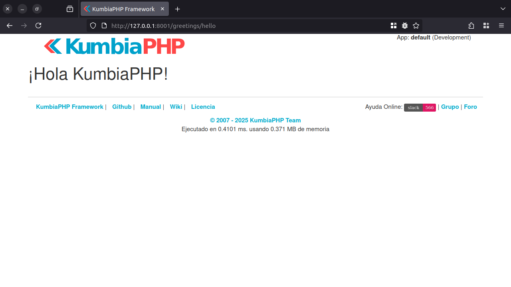
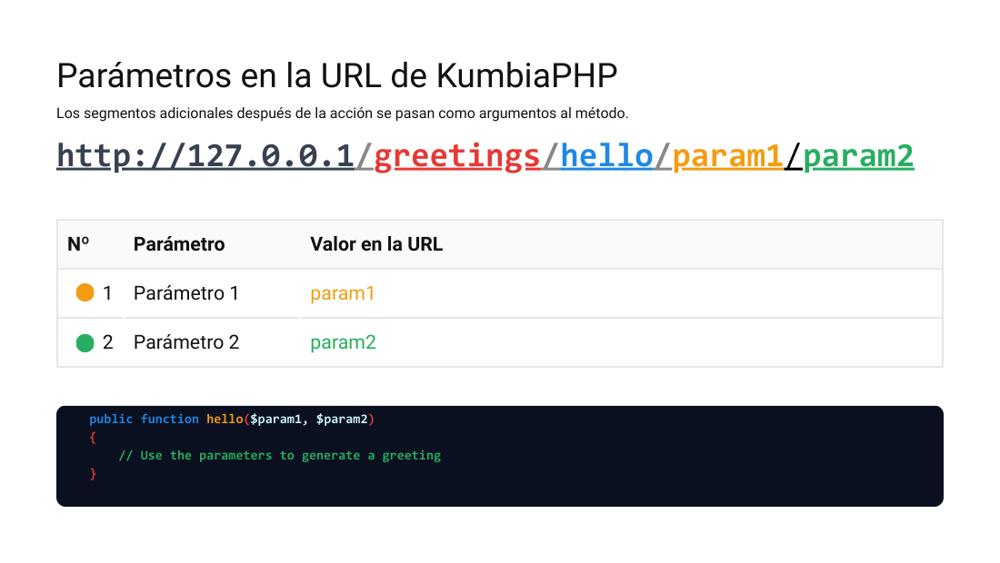
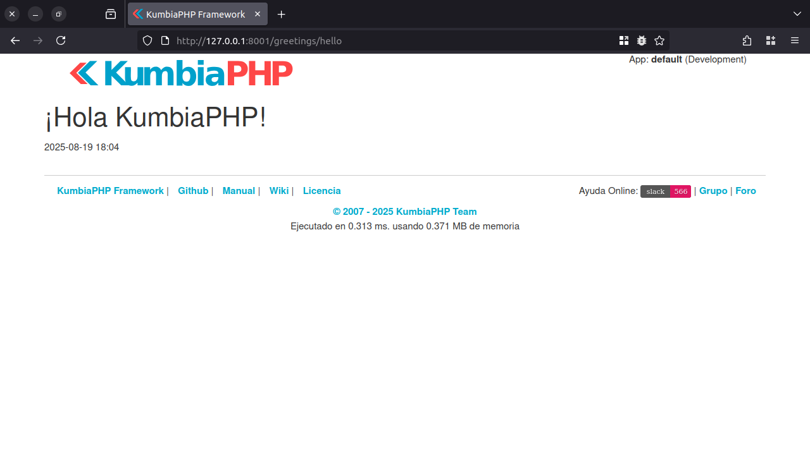
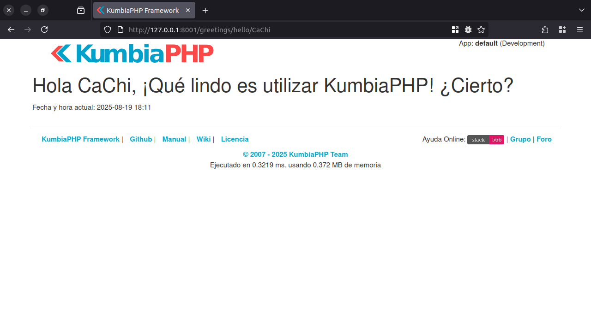
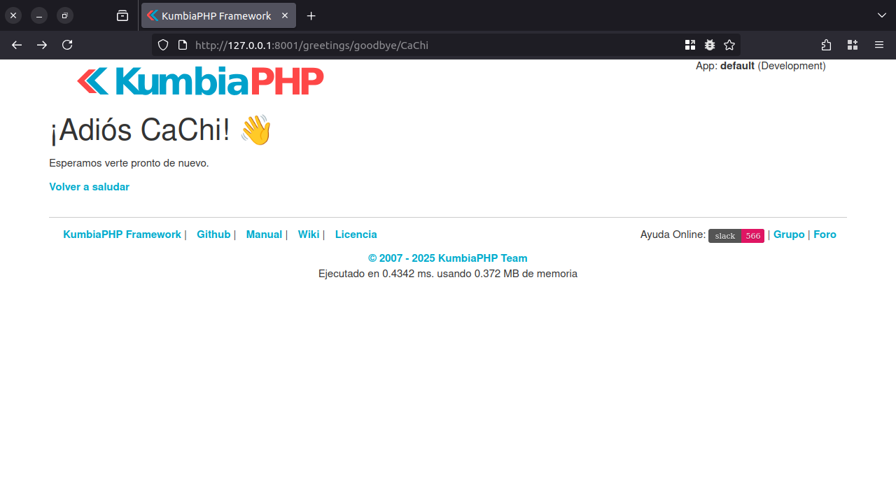

# Mi Primera Aplicación con KumbiaPHP

Después de configurar KumbiaPHP y [visualizar su pantalla de bienvenida](to-install.md), vamos a crear un primer ejemplo
cuyo objetivo es comprender los elementos básicos para utilizar el framework y, al mismo tiempo, entender la
arquitectura **[MVC (Modelo-Vista-Controlador)](mvc.md)**.

## Primer saludo con KumbiaPHP

En este ejemplo haremos el clásico "¡Hola Mundo!", pero con una variación: diremos **"¡Hola KumbiaPHP!"**.
Recordemos el funcionamiento del modelo MVC:

* KumbiaPHP recibe una petición.
* Busca el **controlador** indicado.
* Dentro del controlador, ubica la **acción** que debe atender la petición.
* Finalmente, utiliza esa información para buscar la **vista** asociada y mostrar el resultado.

## Creando el primer controlador

Creamos un controlador en `app/controllers/greetings_controller.php`:

```php
<?php
/** 
 * Controller for greetings
 */
class GreetingsController extends AppController
{
    /**
     * Default greeting action
     *
     * @return void
     */
    public function hello()
    {
    }
}
```

En este código definimos la clase **GreetingsController**.

* El sufijo `Controller` indica que se trata de un controlador.
* Hereda de la clase base **AppController**, lo que le otorga las características necesarias para atender peticiones.
* Incluye el método `hello()`, que actuará como la acción principal de este ejemplo.

## Diseñando la vista asociada

Para mostrar lo que envía el controlador, creamos la **vista asociada**.

1. Creamos una carpeta con el mismo nombre del controlador: `app/views/greetings/`.
2. Dentro de esta carpeta, agregamos un archivo llamado `hello.phtml`, ya que la acción definida se llama `hello()`.

Contenido de la vista:

```html
<h1>¡Hola KumbiaPHP!</h1>
```

Al acceder a `http://127.0.0.1:8001/greetings/hello/`, veremos en pantalla el mensaje como se muestra en la figura 1.


*Figura 1: Contenido de la vista hello.phtml*

## Cómo funcionan las URLs en KumbiaPHP

En KumbiaPHP, las URLs son la forma en que se indica qué controlador y qué acción se deben ejecutar. Gracias a su sistema de reescritura de URLs y al uso de un front-controller, las direcciones son más limpias, fáciles de leer y amigables para [SEO](https://es.wikipedia.org/wiki/Posicionamiento_en_buscadores).

### Anatomía de una URL en KumbiaPHP

En una URL típica, cada segmento tiene un significado: el dominio, el controlador, la acción y, opcionalmente, los parámetros.


*Figura 2: URL en KumbiaPHP*

En KumbiaPHP:

* No se utilizan extensiones `.php` porque todas las peticiones son procesadas por el front-controller.
* Los segmentos adicionales de la URL se interpretan como argumentos que se pasan directamente al método de la acción.

### Parámetros en la URL

Cualquier valor que aparezca después del nombre de la acción se considera un **parámetro**. Estos parámetros llegan como argumentos al método correspondiente en el controlador.

Ejemplo:


*Figura 3: URL con parámetros*

De esta forma, en lugar de usar parámetros tradicionales como `?var=valor&var2=valor2` (largos y poco legibles), KumbiaPHP ofrece **URLs más claras y organizadas**, lo que evita exponer detalles internos del sistema y mejora la experiencia de usuario y el SEO.

## Haciendo el saludo más dinámico

Para hacerlo más dinámico, mostraremos la **fecha y hora actual**. Editamos el controlador:

```php
<?php
/** 
 * Controller for greetings
 */
class GreetingsController extends AppController
{
    /**
     * Greeting action with date
     *
     * @return void
     */
    public function hello()
    {
        $this->date = date("Y-m-d H:i");
    }
}
```

En KumbiaPHP, todas las **variables públicas** definidas en el controlador se transmiten automáticamente a la vista como
variables disponibles.
En este caso, `$this->date` estará disponible en la vista como `$date`.

Editamos `app/views/greetings/hello.phtml`:

```php
<h1>¡Hola KumbiaPHP!</h1>
<?= $date ?>
```

Ahora, al entrar nuevamente a `http://127.0.0.1:8001/greetings/hello/`, veremos la fecha y hora actual (figura 4).


*Figura 4: Hora y fecha de la petición*

> 💡 **Nota**: La sintaxis corta `<?= ?>` es equivalente a `<?php echo ?>`, pero resulta más concisa y legible al momento de imprimir variables en las vistas.

### Pasando parámetros en la URL

Podemos mejorar aún más el saludo solicitando al usuario su nombre como parámetro. Modificamos el controlador:

```php
<?php
/** 
 * Controller for greetings
 */
class GreetingsController extends AppController
{
    /**
     * Greeting action with name and date
     *
     * @param string $name User name
     * @return void
     */
    public function hello($name)
    {
        $this->date = date("Y-m-d H:i");
        $this->name = $name;
    }
}
```

Editamos la vista `hello.phtml`:

```php
<h1>Hola <?= h($name) ?>, ¡Qué lindo es utilizar KumbiaPHP! ¿Cierto?</h1>
<p>Fecha y hora actual: <?= $date ?></p>
```

Al ingresar en `http://127.0.0.1:8001/greetings/hello/CaChi/`, se mostrará un saludo personalizado junto con la fecha actual
(figura 5).


*Figura 5: Saludando al usuario*

> 💡 **Nota:** KumbiaPHP incluye la función h() como atajo de htmlspecialchars(). Se recomienda envolver los valores
dinámicos en h() para evitar problemas de seguridad (XSS) y garantizar que se respete el charset de la aplicación.

## Añadiendo una nueva acción: goodbye()

Hasta ahora hemos creado la acción `hello()` y su vista asociada. Para completar el ejemplo, vamos a añadir una segunda acción dentro del mismo controlador: `goodbye()`.
Con esta nueva acción mostraremos cómo reutilizar la misma lógica aprendida (controlador + vista) pero en este caso para despedir al usuario en lugar de saludarlo.

```php
<?php
/** 
 * Controller for greetings
 */
class GreetingsController extends AppController
{
    /**
     * Greeting action with name and date
     *
     * @param string $name User name
     * @return void
     */
    public function hello($name)
    {
        $this->date = date("Y-m-d H:i");
        $this->name = $name;
    }

    /**
     * Farewell action
     *
     * @param string $name User name
     * @return void
     */
    public function goodbye($name)
    {
        $this->name = $name;
    }
}
```

Ahora creamos la vista `app/views/greetings/goodbye.phtml`:

```php
<h1>¡Adiós <?= h($name) ?>! 👋</h1>
<p>Esperamos verte pronto de nuevo.</p>
<?= Html::linkAction('hello/' . $name, 'Volver a saludar') ?>
```

Si accedemos a `http://127.0.0.1:8001/greetings/goodbye/CaChi`, veremos el mensaje de despedida con un enlace para volver a
saludar (figura 6).


*Figura 6: Despedida al usuario*

El método `Html::linkAction()` es un **helper** que facilita la creación de enlaces. En lugar de escribir manualmente:

```html
<a href="/greetings/hello/CaChi/">Volver a saludar</a>
```

...lo hacemos de manera más limpia y mantenible. Así, si cambiamos el nombre del controller, no tendremos que modificar
cada enlace manualmente.

Con este primer ejemplo hemos aprendido a crear un controlador y sus vistas asociadas en KumbiaPHP, comprender cómo se estructuran las URLs y cómo se transmiten parámetros a las acciones. A través de un sencillo saludo y una despedida, se ilustra de forma práctica la arquitectura MVC, el paso de variables a las vistas y el uso de helpers que simplifican el código. Con estas bases, ya estamos listos para desarrollar aplicaciones más completas con KumbiaPHP.
