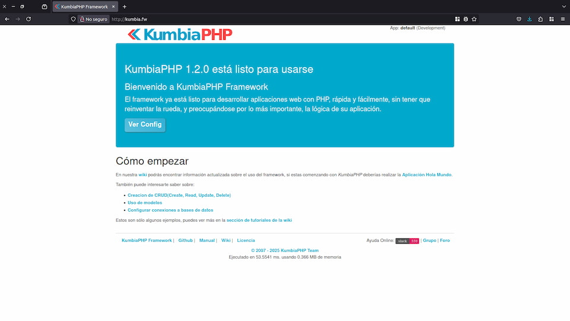
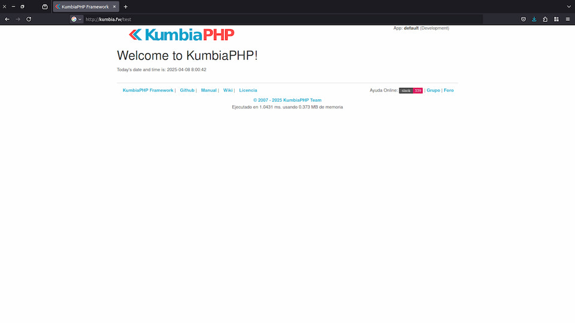

# Instalación de KumbiaPHP en Servidores Web (Apache y Nginx) para GNU/Linux (Debian, Ubuntu y derivados)

Esta sección proporciona instrucciones para instalar y configurar KumbiaPHP utilizando **Apache** o **Nginx** como servidor web en distribuciones Linux como Ubuntu y Debian. Al finalizar, tendrás una instalación funcional de KumbiaPHP lista para el desarrollo.

> ⚠️ **Advertencia**
>
> Esta instalación es un entorno de pruebas, pensado para experimentar con KumbiaPHP en un servidor local. No está recomendada para el desarrollo de aplicaciones que vayan a ser publicadas en producción.

## Requisitos Previos

* **Servidor Web** (Apache HTTP o Nginx) instalado y en ejecución.
* **PHP 8.0** (o posterior) con las extensiones necesarias: `php-mbstring`, `php-xml`, `php-json`, etc.
* Conocimientos básicos de comandos de terminal (`sudo`, mover archivos, etc.).

## Descargar y Descomprimir KumbiaPHP

1. Dirígete a la carpeta donde se alojarán los archivos del proyecto, por ejemplo `/var/www`:

   ```bash
   cd /var/www
   ```

2. **Descarga** el archivo `.tar.gz` más reciente desde el repositorio oficial:

   ```bash
   wget https://github.com/KumbiaPHP/KumbiaPHP/archive/v1.2.1.tar.gz
   ```

3. **Descomprime** el contenido:

   ```bash
   tar -xzvf v1.2.1.tar.gz
   ```

4. (Opcional) **Renombra** la carpeta resultante:

   ```bash
   mv KumbiaPHP-1.2.1 kumbiafw
   ```

## Configuración Específica del Servidor

### Apache

1. Crea un nuevo archivo de configuración en `/etc/apache2/sites-available/`, por ejemplo `kumbiafw.conf`:

```apache
<VirtualHost *:80>
    ServerName kumbia.fw
    DocumentRoot /var/www/kumbiaphp/default/public

    <Directory /var/www/kumbiaphp/default/public>
        AllowOverride All
        Require all granted
    </Directory>
    
    ErrorLog ${APACHE_LOG_DIR}/kumbiafw-error.log
    CustomLog ${APACHE_LOG_DIR}/kumbiafw-access.log combined
</VirtualHost>
```

* Cambia `kumbia.fw` por el dominio o hostname local que desees.
* Ajusta la ruta de `DocumentRoot` a la ubicación donde descomprimiste KumbiaPHP.

2. Activa el nuevo sitio y el módulo `rewrite`:

```bash
sudo a2ensite kumbiafw.conf
sudo a2enmod rewrite
sudo systemctl reload apache2
```

#### ¿Por qué es importante `mod_rewrite`?

`mod_rewrite` es un módulo de Apache que permite reescribir las URLs que utilizan los usuarios. KumbiaPHP encapsula esta funcionalidad, permitiéndote usar URLs limpias y legibles, como las que vemos en blogs o aplicaciones modernas (sin signos como `?`, `&`, ni extensiones como `.php`, `.asp`, `.aspx`, etc.).

Además, con `mod_rewrite`, KumbiaPHP mejora la seguridad de la aplicación al restringir el acceso directo a directorios y archivos internos. Solo el contenido del directorio `public/` será accesible por los usuarios, garantizando que la lógica de negocio y las clases del sistema permanezcan protegidas.

También mejora la indexación en motores de búsqueda, lo que es beneficioso para la visibilidad de tus aplicaciones.

### Nginx

1. Crea un nuevo bloque de servidor en `/etc/nginx/sites-available/kumbiafw`:

**Usando `$_SERVER['PATH_INFO']`:**

```nginx
server {
    listen      80;
    server_name kumbia.fw;
    root        /var/www/kumbiafw/default/public;
    index       index.php index.html index.htm;

    location / {
        try_files $uri $uri/ /index.php$uri?$args;
    }

    location ~ \.php {
        # Extract PATH_INFO after index.php
        fastcgi_split_path_info ^(.+\.php)(/.*)$;

        fastcgi_pass 127.0.0.1:9000;
        # fastcgi_pass unix:/run/php/php-fpm.sock;

        include fastcgi_params;
        fastcgi_param SCRIPT_FILENAME $document_root$fastcgi_script_name;
        fastcgi_param PATH_INFO       $fastcgi_path_info;
    }

    location ~ /\.ht {
        deny all;
    }
}
```

**Usando `$_GET['_url']`:**

```nginx
server {
    listen      80;
    server_name kumbia.fw;
    root        /var/www/kumbiafw/default/public;
    index       index.php index.html index.htm;

    location / {
        try_files $uri $uri/ /index.php?_url=$uri&$args;
    }

    location ~ \.php {
        fastcgi_pass 127.0.0.1:9000;
        # fastcgi_pass unix:/run/php/php-fpm.sock;

        include fastcgi_params;
        fastcgi_param SCRIPT_FILENAME $document_root$fastcgi_script_name;
    }

    location ~ /\.ht {
        deny all;
    }
}
```

* Cambia `server_name` y `root` según tus necesidades.
* Asegúrate de que el socket de PHP-FPM corresponde a tu versión de PHP.

> ℹ️ **Importante**
> Si usas otra versión de PHP (por ejemplo 8.1), ajusta la ruta del socket en Nginx (`fastcgi_pass`) o el módulo correspondiente en Apache.
> Algunas instrucciones pueden variar ligeramente según la versión de Ubuntu o Debian que utilices.

2. Activa el nuevo sitio:

```bash
sudo ln -s /etc/nginx/sites-available/kumbiafw /etc/nginx/sites-enabled/
sudo nginx -t
sudo systemctl reload nginx
```

## Configurar Permisos

Asegúrate de que el usuario del servidor web (generalmente `www-data`) tenga acceso a los archivos:

```bash
sudo chown -R www-data:www-data /var/www/kumbiafw
sudo find /var/www/kumbiafw -type d -exec chmod 755 {} \;
sudo find /var/www/kumbiafw -type f -exec chmod 644 {} \;
```

* Las carpetas tienen permisos `755`.
* Los archivos tienen permisos `644`.

## Probar la Instalación

1. Edita tu archivo `/etc/hosts` para mapear el nombre del servidor:

   ```bash
   sudo nano /etc/hosts
   ```

   Añade esta línea:

   ```
   127.0.0.1   kumbia.fw
   ```

2. Abre tu navegador y visita `http://kumbia.fw`. Deberías ver la página de bienvenida de KumbiaPHP.



## Verificación con un Controlador y Vista

1. Crea un archivo `app/controllers/test_controller.php`:

```php
<?php
/**
 * TestController is an example to demonstrate a basic setup in KumbiaPHP.
 */
class TestController extends AppController
{
    /**
     * Default action
     *
     * This action simply shows a welcome message.
     *
     * @return void
     */
    public function index()
    {
        $this->date = date('Y-m-d H:i:s');
    }
}
```

2. Y su correspondiente vista en `app/views/test/index.phtml`:

```php
<h1>Welcome to KumbiaPHP!</h1>
Today's date and time is: <?= $date ?>
```

3. Visita `http://kumbia.fw/test` en tu navegador para ver el mensaje de bienvenida.


