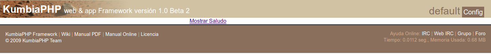
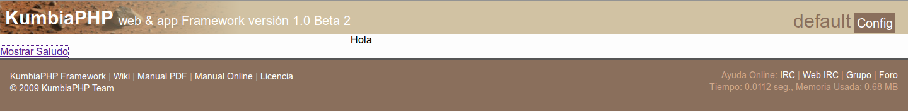

# La Vista

KumbiaPHP proporciona un sistema de presentación, basado en Vistas (Views) que viene siendo el tercer componente del sistema MVC, como vimos en la sección "Modelo, Vista, Controlador ". Las vistas son plantillas de código reutilizable que sirven para mostrar los datos al usuario y se encuentran ubicadas en el directorio app/views/ .

Es buena práctica de desarrollo, que las vistas contengan una cantidad mínima de código en PHP, para que sea suficientemente entendible para un diseñador Web.
De ese modo las vistas sólo harán las tareas de visualizar los resultados generados por los controladores y presentarán las capturas de datos para usuarios.

El manejador de vistas implementa el patrón de diseño de vista en dos pasos: le primero es utilizar una vista o «view» asociada a una acción del controlador para convertir los datos que vienen del modelo en lógica de presentación sin especificar ningún formato específico; el segundo paso es establecer el formato de presentación a través de una plantilla o «template».

Asímismo tanto las vistas de acción como las plantillas pueden utilizar vistas parciales o «partials». Estas vistas parciales son fragmentos de vistas que son compartidas por distintas vistas, de manera que constituyen lógica de presentación reutilizable en la aplicación. Ejemplos: menús, cabeceras, pies de página, entre otros.

KumbiaPHP favorece siempre los convenios, y asume los siguientes respecto a las vistas:

  * Todos los archivos de vistas deben tener la extensión .phtml .
  * Cada controlador tiene un directorio de vistas asociado cuyo nombre coincide con el nombre del controlador en notación smallcase. Por ejemplo: si posees un controlador cuya clase se denomina «PersonalTecnicoController» ésta por convenio tiene un directorio de vistas «personal_tecnico».
  * Cada vez que se ejecuta una acción se intenta cargar una vista cuyo nombre es el mismo que el de la acción ejecutada.
  * Los templates deben ubicarse en el directorio views/_shared/templates .
  * Las vistas parciales (partials) deben ubicarse en el directorio views/_shared/partials .
  * Por defecto se utiliza el template «default» para mostrar las vistas de acción.

Para indicar una vista diferente a la asumida por convención se debe utilizar
el método View::select()  en el controlador. Por ejemplo:

```php
<?php  
class SaludoController extends AppController
{  
    public function saludo()
    {   
           View::select('hola');   
    }  
}
```  

De esta manera luego de que se ejecute la acción «saludo» se mostrará la vista
saludo/hola.phtml  utilizando el template default .

En caso de que no desee mostrar una vista, solamente debe pasar NULL  como
argumento de View::select() .

```php
<?php  
class SaludoController extends AppController
{  
    public function index()
    {   
           View::select(NULL);   
    }  
}  
```  

Para finalizar este apartado, cabe destacar que tanto las vistas de acción, los
templates y los partials son vistas, pero por comodidad se suele referir a la
vista de acción sencillamente bajo el nombre de «vista».

## Pasando datos a la vista

Para pasar datos a la vista estos deben cargarse como atributos públicos del
controlador y luego de que se ejecute la acción, el manejador de vistas
cargará los atributos públicos del controlador como variables de ámbito local
en la vista. Ejemplo:

El controlador: `controllers/saludo_controller.php`
```php
<?php  
class SaludoController extends AppController
{  
    public function  hola()
    {   
           $this->usuario  = 'Mundo' ;   
    }  
}  
```  


La vista: `views/saludo/hola.phtml`
```php
Hola <?php echo $usuario ?>  
```  

## Buffer de salida

Para mostrar el contenido del buffer de salida se hace uso del método
View::content() , donde el contenido del buffer de salida lo constituye
principalmente los echo o print que efectúe el usuario y asímismo los mensajes
Flash. Al invocar View::content() se muestra el contenido del buffer de
salida en el lugar donde fue invocado.

El controlador: `saludo_controller.php`

```php
<?php  
class SaludoController extends AppController
{  
    public function hola()
    {   
           Flash::valid('Hola Mundo');   
    }  
}  
```

La vista: `hola.phtml`

```php
Saludo realizado:  
<?php View::content() ?>  
```

## Template

Los templates constituyen la capa más externa de la vista que se mostrará
luego de ejecutar una acción del controlador, de manera que permite establecer
el formato de presentación apropiado para la vista.

Cuando se habla de formato no se refiere unicamente al tipo de documento, si
no también a elementos como cabeceras y menús. Por ende el template está
compuesto por aquellos elementos que en conjunto son utilizados para la
presentación de diversas vistas, dando de esta manera un formato de
presentación reutilizable.

### ¿Cómo crear un Template?

Para construir un nuevo template se debe crear un archivo con extensión .phtml
en el directorio views/_shared/templates/  el cual debe corresponder con el
nombre del template.

Como se explicó anteriormente al inicio del cápitulo " La Vista ", el
manejador de vistas utiliza el patrón de diseño de «vista en dos pasos». En el
primer paso, se procesa la vista de acción, luego la vista de acción procesada
se almacena en el buffer de salida y en el segundo paso se procesa el
template.

En consecuencia, como la vista de acción procesada se acumula en el buffer de
salida es necesario invocar el método View::content() en el lugar donde se
desea mostrar la vista, tal como indicamos en la sección " Buffer de salida " .

Ejemplo:

`views/_shared/templates/ejemplo.phtml`
```php
<!DOCTYPE html>  
<html>  
<head>  
   <title>Template de Ejemplo</title>  
</head>  
<body>  
   <h1>Template de Ejemplo</h1>  

    <?php View::content() ?>   
</body>  
</html>  
```

### ¿Cómo utilizar un template?

Para seleccionar el template a utilizar se debe invocar el método
View::template()  pasando como argumento el template a utilizar. Ejemplo:

En el controlador:

```php
<?php  
class SaludoController extends AppController
{  
    public function  hola()
    {   
           // Selecciona el template 'mi_template.phtml'   
           View::template('mi_template');   
    }  
}  
```  

Asímismo es posible indicar al manejador de vistas que no utilice ningún
template y por lo tanto muestre solamente la vista, para esto se debe pasar
NULL como argumento a View::template() .

```php
<?php  
class SaludoController extends AppController
{  
    public function  hola()
    {   
           // No utilizar template   
           View::template(NULL);   
    }  
}  
```  

### Pasando datos al template

Como se vio en la sección " Pasando datos a la vista ", los atributos públicos
del controlador se cargan como variables de ámbito local en la vista. Como
mostrar el template, constituye el segundo paso para mostrar la vista
completa, los atributos públicos del controlador estarán de igual manera
cargados como variables de ámbito local en el template. Ejemplo:

En el controlador saludo_controller.php
```php
<?php  
class SaludoController extends AppController
{  
    public function  hola()
    {   
           Flash::valid('Hola Mundo');   

            // Pasando el titulo para la pagina   
           $this->titulo  = 'Saludando al Mundo';   

            /* No se utilizara vista, por lo tanto la   
                    salida sera del buffer y template */   
           View::select(NULL, 'saludo');   
    }  
}  
```

En el template saludo.phtml

```php
<!DOCTYPE html>  
<html>  
<head>  
   <title> <?php echo $titulo ?></title>  
</head>  
<body>  
   <h1>Template de Saludo</h1>  

    <?php View::content() ?>   
</body>  
</html>  
```  

## Partial

Los partials o «vistas parciales» son fragmentos de vistas que son compartidas
por distintas vistas, de manera que constituyen lógica de presentación
reutilizable en la aplicación. Por lo general los partials son elementos como:
menús, cabecera, pie de página, formularios, entre otros.

### ¿Cómo crear un partial?

Para construir un nuevo partial se debe crear un archivo con extensión .phtml
en el directorio views/_shared/partials/  el cual debe corresponder con el
nombre del partial.

Ejemplo:

`views/_shared/partials/cabecera.phtml`

```php
<h1>Template de Saludo</h1>  
```  

### ¿Cómo utilizar un partial?

Para utilizar un partial se debe invocar el método View::partial()  indicando
como argumento el partial deseado. La vista parcial se mostrará en el lugar
donde se invocó.

Ejemplo utilizando un partial en un template:
```php
<!DOCTYPE html>  
<html>  
<head>  
   <title>Ejemplo</title>  
</head>  
<body>  
    <?php View::partial('cabecera') ?>   

    <?php View::content() ?>   
</body>  
</html>  
```

Cabe destacar que los partial se pueden utilizar tanto en vistas de acción,
templates e incluso dentro de otros partials.

### Pasando datos a los partials

Para pasar datos a un partial, estos se deben indicar en un array asociativo
donde cada clave con su correspondiente valor se cargarán como variables en el
ámbito local del partial.

Ejemplo:

`views/partials/cabecera.phtml`

```php
<h1>Título: <?php echo $titulo ?></h1>  
```  

`views/ejemplo/index.phtml`

```php
<?php View::partial('cabecera', false, array('titulo' =>'Ejemplo')) ?>  

<p>  
Este es un ejemplo  
</p>  
```  


## Agrupando en directorios

En KumbiaPHP tanto las vistas, los partials y los templates pueden agruparse
en directorios, utilizando el separador «/» en la ruta .

### Ejemplo de agrupación de vista

La vista views/usuario/clasificado/fomulario.phtml , se utiliza de la
siguiente manera en el controlador:

```php
<?php  
class UsuarioController extends AppController
{  
    public function nuevo()
    {   
           // Selecciona la vista   
           View::select('clasificado/formulario');   
    }  
}  
```

### Ejemplo de agrupación de partial

El partial views/_shared/partials/usuario/formulario.phtml , se utiliza de la
siguiente manera ya sea en vista o en template:

```php
<h1>Nuevo Usuario</h1>  
<?php View::partial('usuario/formulario') ?>  
```

### Ejemplo de agrupación de template

El template views/_shared/templates/usuario/administrador.phtml , se utiliza
de la siguiente manera en el controlador:

```php
<?php  
class AdministradorController extends AppController
{  
    protected function before_filter(){   
           // Selecciona el template   
           View::template('usuario/administrador');   
   }  
}  
```

## Tipos de respuestas

Los tipos de respuestas son utilizados para establecer distintos formatos de
la vista. Por ejemplo: xml, json y pdf.

Para establecer un tipo de respuesta se debe invocar el método
View::response()  indicando la respuesta deseada, una vez que se indica el
tipo de respuesta este es automáticamente colocado como extensión del archivo
de vista. En consecuencia utilizar los tipos de respuestas en conjunto a los
template constituyen una potente herramienta para generación de vistas
completas para el usuario.

Ejemplo:
```php
<?php  
class UsuarioController extends AppController
{  
    public function index()
    {   
           // Establece el tipo de respuesta   
           View::response('json');   
    }  
}  
```

En este ejemplo se mostrara la vista index.json.phtml .

## Uso de cache en las vistas

El manejador de vistas proporciona mecanismos a través de los cuales las
vistas, los partials y los templates se pueden cachear. El usuario indica el
tiempo durante el cual estos estarán almacenados en la cache de manera que el
manejador de vistas cargará estos elementos sin necesidad de procesarlos,
aumentando el rendimiento de la aplicación.

En este sentido para indicar el tiempo de cache se sigue el formato de la
función strtotime de PHP. Ejemplo: '+1 week';

### Cache de vistas

Para cachear una vista se utiliza el método View::cache()  en el controlador.

```php
<?php  
class UsuarioController extends AppController
{  
    public function index()
    {   
           // Indica el tiempo de cache de la vista   
           View::cache('+20 days');   
    }  
}
```  

Cabe destacar que la acción en el controlador se ejecuta, debido a que los
datos pasados a la vista pueden de igual manera ser requeridos en el template.

#### Grupos de vistas en cache

Las vistas cacheadas se pueden almacenar en grupos. Los grupos son muy
interesantes, ya que se puede borrar la cache por grupos también. Ejemplo:
guardar cache de posts en un grupo, al crear, editar o borrar un post, podemos
borrar la cache de ese grupo, para que se regenere la cache.

En este caso es necesario indicar en el método View::cache()  que se cacheara
una vista en un grupo especifico.

```php
<?php  
class UsuarioController extends AppController
{  
    public function index()
    {   
           // Indica el tiempo de cache de la vista   
           View::cache('+20 days' ,'view' ,'miGrupo');   
    }  
}  
```

### Cache de templates

Cachear un template consiste en cachear en conjunto tanto la vista y template
para una url especifica. Para cachear un template se usa el método
View::cache()  en el controlador indicando el tiempo durante el cual estará
cacheado el template.

```php
<?php  
class UsuarioController extends AppController
{  
    public function index()
    {   
           // Indica el tiempo de cache de template   
           View::cache('+20 days', 'template');   
    }  
}  
```

Cabe destacar que para aumentar el rendimiento no se ejecuta la acción en el
controlador, debido a que mostrar el template es el último paso que realiza el
manejador de vistas para mostrar la vista al usuario y en este paso ya todos
los datos enviados a la vista y template han sido utilizados.

### Cache de partials

Para cachear partials se debe indicar como segundo argumento al invocar
View::partial() el tiempo durante el cual estará cacheado.

```php
<?php View::partial('usuario', '+1 day') ?>    
<?php View::partial('usuario', '+1 day', array('nombre'=>'pepe')) ?>  
```

## Helpers

Los helpers (ayudas) se usan en los views. Encapsulan código en métodos para
su fácil reuso.

KumbiaPHP ya viene con helpers creados.

Pero lo realmente útil, es que los usuarios pueden crear sus propios
helpers y colocarlos en app/extensions/helpers/. Y después usarlos
tranquilamente en sus views. KumbiaPHP cargará transparentemente
sus helpers así como los uses.

### Html

Clase con métodos estáticos con la que podemos crear etiquetas HTML
optimizadas respetando las convenciones de KumbiaPHP.

#### Html::img()

Permite incluir una imagen

$src ruta de la imagen

$alt atributo alt para la imagen

$attrs atributos adicionales

img ($src, $alt=NULL, $attrs = NULL)  

```php

/*Ejemplo*/

echo Html::img('spin.gif' ,'una imagen');   //se muestra la imagen
spin.gif que se encuentra dentro de "/public/img/"

//con el artibuto alt 'una imagen'  
```

#### Html::link()

Permite incluir un link

$action ruta a la acción

$text texto a mostrar

$attrs atributos adicionales

Html::link ($action, $text, $attrs = NULL)  

```php
/*Ejemplo*/

echo Html::link('pages/show/kumbia/status' ,'Configuración');   //se
muestra un link con el texto 'Configuración'  
```

#### Html::lists()

Crea una lista html a partir de un array

$array contenido de la lista

$type por defecto ul, y si no ol

$attrs atributos adicionales
```php
Html::lists($array ,$type = 'ul' ,$attrs = NULL)   

/*Ejemplo*/
```
$ar = array(
  'Abdomen'    =>   'Abdomen' ,
  'Brazos'     =>   'Brazos' ,
  'Cabeza'     =>   'Cabeza' ,
  'Cuello'     =>   'Cuello' ,
  'Genitales'  =>   'Genitales' ,
  'Piernas'    =>   'Piernas' ,
  'Torax'      =>   'Torax' ,
  'Otros'      =>   'Otros'
   );
//$ar el array que contiene los items de la lista
echo  Html::lists($ar, $type = 'ol');   //Muestra una lista
<ol></ol>
$ar2 = array('Abdomen', 'Brazos', 'Cabeza', 'Cuello', 'Genitales',
'Piernas', 'Torax', 'Otros');
echo  Html::lists($ar2 , $type = 'ol');   //Muestra una lista
<ol></ol>  
```

#### Html::gravatar()

Incluye imágenes de gravatar.com

$email Correo para conseguir su gravatar

$alt Texto alternativo de la imagen. Por defecto: gravatar

$size Tamaño del gravatar. Un numero de 1 a 512. Por defecto: 40

$default URL gravatar por defecto si no existe, o un default de gravatar. Por
defecto: mm

`Html::gravatar($email, $alt='gravatar', $size=40, $default='mm')`
```php
echo Html::gravatar($email);   // Simple
echo Html::link(Html::gravatar($email), $url);   // Un gravatar que es un link
echo Html::gravatar($email ,$name , 20 , 'http://www.example.com/default.jpg');
//Completo   
```

#### Html::includeCss()

Incluye los archivos CSS que previamente fueron cargados a la lista mediante
Tag::css()

```php
Tag::css('bienvenida');     //Pone en lista un CSS (app/public/css/bienvenida.css)
echo Html::includeCss();   //Adiciona los recursos enlazados de la clase en el proyecto  
```

#### Html::meta()

Crea un metatag y lo agrega a una lista estática que será añadida más adelante
mediante Html::includeMetatags();

$content contenido del metatag

$attrs atributos adicionales del tag

Html::meta($content, $attrs = NULL)   

```php
Html::meta('Kumbiaphp-team' ,"name = 'Author'");  
//Agrega: <meta content="Kumbiaphp-team" name = 'Author' />
Html::meta('text/html; charset=UTF-8' ,"http-equiv = 'Content-type'");  
//Agrega: <meta content="text/html; charset=UTF-8" http-equiv = 'Content-type'/>  
```

#### Html::includeMetatags()

Agrega los metatag que previamente se habían agregado

```php
Html::meta ('Kumbiaphp-team' , "name = 'Author'");
Html::meta ('text/html; charset=UTF-8' , "http-equiv = 'Content-type'");
echo Html::includeMetatags();   //Visualiza <meta content="Kumbiaphp-team" name = 'Author'/>
```

#### Html::headLink()

Agrega un elemento de vínculo externo de tipo [<link> ](http://html.conclase.net/w3c/html401-es/struct/links.html#h-12.3) a la cola de
enlaces (para poder ser visualizado se requiere de Html::includeHeadLinks() de
modo similar que Html::includeCss())

$href dirección url del recurso a enlazar

$attrs atributos adicionales

```php
Html::headLink($href, $attrs = NULL)  

Html::headlink('http://www.kumbiaphp.com/public/style.css', "rel='stylesheet',type='text/css' media='screen'");
//Se agrega a la cola de links el enlace a un recurso externo, en este caso la hoja de estilo ubicada en "http://www.kumbiaphp.com/public/style.css"

/*Agrega a la cola de links "<link rel="alternate" type="application/rss+xml"
title="KumbiaPHP Framework RSS Feed" href="http://www.kumbiaphp.com/blog/feed/" />" con lo cual
podemos incluir un feed sin usar las convenciones de kumbiaphp */

Html::headlink('http://www.kumbiaphp.com/blog/feed/', "rel='alternate'
type='application/rss+xml' title='KumbiaPHP Framework RSS Feed'");

Html::headlink('http://www.kumbiaphp.com/favicon.ico' , "rel='shortcut
icon',type='image/x-icon'");   //Agrega la etiqueta <link> para usar un favicon externo

echo  Html::includeHeadLinks();   //Muestra los links que contiene la cola  
```

#### Html::headLinkAction()

Agrega un elemento de vínculo interno de tipo [<link>](http://html.conclase.net/w3c/html401-es/struct/links.html#h-12.3) a la cola de
enlaces (para poder ser visualizado se requiere de Html::includeHeadLinks() de
modo similar que Html::includeCss()) respetando las convenciones de KumbiaPHP.

$href dirección url del recurso a enlazar

$attrs atributos adicionales

Html::headLinkAction($action, $attrs = NULL)  

```php
/*Agrega a la cola de links "<link rel="alternate" type="application/rss+xml"
title="KumbiaPHP Framework RSS Feed" href="http://www.kumbiaphp.com/blog/fee
d/" />" con lo cual podemos incluir un feed usando las convenciones de KumbiaPHP.
Siendo 'articulos/feed' el nombre de la vista con el contenido del feed */

Html::headLinkAction('articulos/feed', "rel='alternate'
type='application/rss+xml' title='KumbiaPHP Framework RSS Feed'");
echo  Html::includeHeadLinks();   //Muestra los links que contiene la cola  
```  

#### Html::headLinkResource()

Agrega un elemento de vínculo a un recurso interno con la etiqueta [<link> ](http://html.conclase.net/w3c/html401-es/struct/links.html#h-12.3) a la cola de enlaces (para poder ser visualizado se requiere de
Html::includeHeadLinks())

$resource ubicación del recurso en public

$attrs atributos adicionales

Html::headLinkResource($resource, $attrs = NULL)  

```php
//Agrega la etiqueta <link> para usar un favicon interno ubicado en el directorio '/public/'
Html::headLinkResource('favicon.ico', "rel='shortcut
icon', type='image/x-icon'");   
echo Html::includeHeadLinks();   //Muestra los links que contiene la cola  
```

#### Html::includeHeadLinks()

Incluye los links que previamente se pusieron en cola

```php
Html::headlink('http://www.kumbiaphp.com/favicon.ico', "rel='shortcut
icon', type='image/x-icon'");   //Agrega la etiqueta <link> para usar un favicon externo

Html::headLinkAction('articulos/feed', "rel='alternate' type='application/rss+xml' title='KumbiaPHP Framework RSS Feed'");
echo  Html::includeHeadLinks();  
```  

### Tag

Esta clase nos va a permitir adicionar archivos JS y CSS a nuestro proyecto,
bien sean archivos que se encuentren en nuestro servidor o en un servidor
externo.

Las funciones de esta clase son de tipo estatificas, lo que nos permite usarlas
directamente de la forma como se presentan a continuación.

#### Tag::css()

Incluye un archivo CSS a la lista

```php
Tag::css ('bienvenida');     //Pone en lista un CSS (app/public/css/bienvenida.css)
echo  Html::includeCss();   //Adiciona los recursos enlazados de la clase en el proyecto  
```

#### Tag::js()

Incluye un archivo JavaScript a la vista, partial o template
```php
<?= Tag::js('jquery/jquery.kumbiaphp'); //Adiciona un archivo javascript (/app/public/javascript/jquery/jquery.kumbiaphp.js)  
?>  
```

### Clase Form

Clase para el manejo y la creación de formularios

#### Form::open()

Crea una etiqueta de formulario

$action acción a la que envía los datos, por defecto llama la misma acción de
donde proviene

$method 'POST', 'GET', 'DELETE', 'HEAD', 'PUT'. Por defecto se tiene en 'POST'

$attrs atributos adicionales

Form::open($action = NULL, $method = 'POST', $attrs = NULL)  

```php
/*Ejemplo*/  
<?= Form::open() ?> //inicia un formulario que enviara los datos a la acción que corresponde al controller actual  
<?= Form::open('usuarios/nuevo') ?>  //inicia un formulario que enviara los datos al controller 'usuarios' y la accion 'nuevo'  
```

#### Form::openMultipart()

Crea una etiqueta de formulario multipart, este es ideal para formularios que
contienen campos de subida de archivos

$action acción a la que envía los datos, por defecto llama la misma acción de
donde proviene

$attrs atributos adicionales

Form::openMultipart ($action = NULL, $attrs = NULL)  

```php
/*Ejemplo*/
//inicia un formulario multipart que enviará los datos a la acción que corresponde a la vista actual
echo Form::openMultipart();
//inicia un formulario multipart que enviará los datos al controller 'usuario' y la acción 'nuevo'  
echo Form::openMultipart('usuarios/nuevo');
```

#### Form::close()

Crea una etiqueta de cierre de formulario

```php
/*Ejemplo*/
echo Form::close();
//crea una etiqueta de cierre de formulario </form>  
```  

#### Form::input()

Crea un campo de tipo input

$attrs atributos para el tag

$content contenido interno

Form::input($attrs = NULL, $content = NULL)  

```php
/*Ejemplo*/
echo Form::input('nombre');  
```

#### Form::text()

Crea un campo de tipo input

Siempre que se le da el parámetro name de la forma model.campo, es decir un
nombre que contenga un punto dentro del string, se crea el campo de texto con
el name= "model[campo]" y el id="model_campo".

$field Nombre de campo

$attrs atributos de campo

$value valor inicial para el input

Form::text($field, $attrs = NULL, $value = NULL)  

```php
/*Ejemplo*/
//crea un campo de tipo texto con el parámetro name= "nombre", id = "nombre"
echo Form::text('nombre');
//crea un campo de tipo texto con el parámetro name= "usuario[nombre]", id = "usuario.nombre"
echo Form::text('usuario.nombre');   
//crea un campo de tipo texto con el parámetro name= "nombre", id = "nombre", class= "caja", value = "55"  
echo Form::text('nombre', "class='caja'", '55');   
```

#### Form::pass()

Crea un campo de tipo Password

$field nombre de campo

$attrs atributos de campo

$value valor inicial para el campo

Form::pass($field, $attrs = NULL, $value = NULL)  

```php  
/*Ejemplo*/
echo Form::pass('password');   //crea un campo de tipo password con el
parámetro name= "password"  
```

#### Form::textarea()

Crea un textarea

$field nombre de campo

$attrs atributos de campo

$value valor inicial para el textarea

Form::textarea($field, $attrs = NULL, $value = NULL)  

```php
echo Form::textarea('detalles');   //Crea un textarea  
```

#### Form::label()

Crea un label y lo asocia a un campo

$text texto a mostrar

$field campo al que hace referencia

$attrs array de atributos opcionales

Form::label($text, $field, $attrs = NULL)  

```php
//Crea un label
para el campo nombre con el texto 'nombre de usuario:'
echo Form::label('nombre de usuario:', 'nombre');  
echo Form::text('nombre');  
```  

#### Form::hidden()

Crea un campo hidden (campo oculto)

$field nombre de campo

$attrs atributos adicionales de campo

$value valor inicial para el campo oculto

Form::hidden($field, $attrs = NULL, $value = NULL)  

```php
echo Form::hidden('id', null, 12);   //Crea un campo oculto con el name="id" y el value="12"  
```

#### Form::dbSelect()

Crea campo Select que toma los valores de objetos de ActiveRecord, para esta
versión del framework el uso de este helper ha sido simplificado. Ya no es
necesario instanciar el modelo.

$field nombre del modelo y campo pk (bajo la convención modelo.campo_id)

 $show campo que se mostrará

 $data array de valores, array('modelo','m e todo','param')

$blank campo en blanco

$attrs atributos de campo

$value valor inicial para el campo

```php
Form::dbSelect($field, $show = NULL, $data = NULL, $blank = NULL, $attrs =
NULL, $value = NULL)  
```  

Vista

```php
//la forma más facil, carga el modelo(campo) y muestra el primer campo después del pk(id)
echo Form::dbSelect('usuarios.campo_id');
//muestra el campo y lo ordena ascendentemente    
echo Form::dbSelect('usuarios.campo_id', 'campo');  
```

#### Form::select()

Crea un campo Select (un combobox)

$field nombre de campo

$data array de valores para la lista desplegable

$attrs atributos de campo

$value valor inicial para el campo

Form::select($field, $data, $attrs = NULL, $value = NULL)  

```php
$ar2 = array('Abdomen', 'Brazos', 'Cabeza', 'Cuello', 'Genitales', 'Piernas', 'Torax', 'Otros');
//Crea un campo Select (un combobox) con el nombre 'region' y teniendo preseleccionado 'Cuello'  
echo Form::Select('region', $ar2, null, 'Cuello');   
 ```  

Resultado:

```php
<select id="region" name="region">
  <option value="0">Abdomen</option>
  <option value="1">Brazos</option>
</select>  
```

Otra Posibilidad:
```php
$ar2 = array('Abdomen' => 'Abdomen', 'Brazos' => 'Brazos', 'Cabeza' =>
'Cabeza', 'Cuello' => 'Cuello', 'Genitales' => 'Genitales', 'Piernas' =>
'Piernas', 'Torax' => 'Torax', 'Otros' => 'Otros');

echo Form::Select('region', $ar2, null, 'Cuello');  
```

Resultado:

```php
<select id="region" name="region">
  <option value="Abdomen">Abdomen</option>
  <option value="Brazos">Brazos</option>
</select>  
```

#### Form::file()

Crea campo File para subir archivos, el formulario se debe abrir con
Form::openMultipart()

$field nombre de campo

$attrs atributos de campo

Form::file($field, $attrs = NULL)  

```php  
echo Form::openMultipart();   //Abre el formulario multipart
echo Form::file('subir');  //Crear el campo para subir archivos
echo Form::close();   //Cierra el formulario  
```

#### Form::button()

Crea un botón

$text texto del botón

$attrs atributos del botón

Form::button($text, $attrs = NULL)  

```php
echo Form::button('calcular');   //Crea un botón con el texto 'calcular'  
```  

#### Form::submitImage()

Crea un botón de tipo imagen siguiendo las convenciones de KumbiaPHP, la
imagen deberá estar dentro del directorio '/public/img/'

$img ruta de la imagen que usa el botón

$attrs atributos del botón

Form::submitImage($img, $attrs = NULL)  

```php  
echo Form::submitImage('botones/edit.gif');   //Crea un botón con la imagen 'botones/edit.gif'  
```

#### Form::submit()

Crea un botón de submit para el formulario actual

$text texto del botón

$attrs atributos del botón

Form::submit($text, $attrs = NULL)  

```php
echo Form::submit('enviar');   //Crea un botón con el texto 'enviar'  
```

#### Form::reset()

Crea un botón reset para el formulario actual

$text texto del botón

$attrs atributos del botón

Form::reset($text, $attrs = NULL)  

```php
echo Form::reset('reiniciar');   //Crea un botón con el texto
'reiniciar'  
```

#### Form::check()

Crea un checkbox

$field nombre de campo

$value valor en el checkbox

$attrs atributos de campo

$checked indica si se marca el campo

Form::check($field, $value, $attrs = NULL, $checked = NULL)  

```php
// Crea un check seleccionado con id="recuerdame" , name="recuerdame" y value="1"
echo  Form :: check ( 'recuerdame' , '1' , '' , true ) ;  
// Crea un check NO seleccionado con id="recuerdame" , name="recuerdame" y value="1"
echo  Form :: check ( 'recuerdame' , '1' , '' , false ) ;     
```

#### Form::radio()

Crea un radio button

$field nombre de campo

$value valor en el radio

$attrs atributos de campo

$checked indica si se marca el campo

Form::radio($field, $value, $attrs = NULL, $checked = NULL)  

```php  
$on   =   'masculino' ;
//<input id="rdo1" name="rdo" type="radio" value="masculino" checked="checked">
echo Form::radio("rdo", 'masculino', null, true);  
//<input id="rdo2" name="rdo" type="radio" value="femenino">  
echo Form::radio("rdo", 'femenino');
```  

### Js

Este helper ofrece algunas implementaciones que utilizan javascript simple.

#### Js::link ()

Crea un enlace que al pulsar muestra un diálogo de confirmación para
redireccionamiento a la ruta indicada.

$action ruta a la acción

$text texto a mostrar

$confirm mensaje de confirmación

$class clases adicionales para el link

$attrs $attrs atributos adicionales

 `Js::link ($action, $text, $confirm = '¿Está Seguro?', $class = NULL, $attrs =
NULL)`

```php
<?= Js::link('usuario/eliminar/5', 'Eliminar') ?>  
```

Si desea aplicar una clase de estilo al enlace debe indicarlo en el argumento
$class .

```php  
<?= Js::link('usuario/eliminar/5', 'Eliminar', '¿Está seguro de esta
operación?', 'b_eliminar') ?>  
```

#### Js::linkAction ()

Crea un enlace que al pulsar muestra un diálogo de confirmación para
redireccionamiento a la acción indicada.

$action acción de controlador

$text texto a mostrar

$confirm mensaje de confirmación

$class clases adicionales para el link

$attrs $attrs atributos adicionales

 `Js::linkAction($action, $text, $confirm = '¿Está Seguro?', $class = NULL,
$attrs = NULL)`

```php
<?php echo Js::linkAction('eliminar/5', 'Eliminar'); ?>  
//Si desea aplicar una clase de estilo al enlace debe indicarlo en el argumento $class
<?php echo Js::linkAction('eliminar/5', 'Eliminar', '¿Está seguro de esta operacion?', 'b_eliminar') ?>  
```  

#### Js::submit ()

Crea un botón submit que al pulsar muestra un diálogo de confirmación.

$text texto a mostrar

$confirm mensaje de confirmación

$class clases adicionales para el link

$attrs atributos adicionales

 `Js::submit ($text, $confirm = '¿Está Seguro?', $class = NULL, $attrs = NULL)`

```php
<?php echo Js::submit('Guardar') ?>  
//Si desea aplicar una clase de estilo al boton debe indicarlo en el argumento $class .
<?= Js::submit('Guardar', '¿Está Seguro?', 'boton_guardar') ?>  
```

#### Js::submitImage ()

Crea un botón tipo image que al pulsar muestra un diálogo de confirmación.

$img ruta a la imagen

$confirm mensaje de confirmación

$class clases adicionales para el link

$attrs atributos adicionales

 `Js::submitImage($img $confirm = '¿Está Seguro?', $class = NULL, $attrs = NULL)`

```php  
<?php echo Js::submitImage('botones/guardar.png') ?>  
//Si desea aplicar una clase de estilo al botón debe indicarlo en el argumento $class .
<?= Js::submitImage('botones/guardar', '¿Está Seguro?', 'boton_guardar') ?>  
```  

### Ajax

Este helper ofrece implementaciones para facilitar la integración con AJAX.

#### Ajax::link()

Crea un enlace que actualiza la capa indicada con el contenido producto de la
petición web.

$action ruta a la acción

$text texto a mostrar

$update capa a actualizar

$class clases adicionales

$attrs atributos adicionales

 `Ajax::link ($action, $text, $update, $class=NULL, $attrs=NULL)`


Como ejemplo, crea un enlace que al pulsar emita un saludo. Con el fin
anterior se tienen las siguientes vistas y controladores:

controllers/saludo_controller.php
```php  
<?php
class SaludoController extends AppController
{
    public function index()
    {}

    public function hola()
    {
        View::template(NULL);
    }
}  
```  
views/saludo/hola.phtml

Hola  


views/saludo/index.phtml
```php  
<div id="capa_saludo"></div>
<?php
    echo Ajax::link('saludo/hola', 'Mostrar Saludo', 'capa_saludo');
    echo Tag::js('jquery/jquery+kumbiaphp.min');
?>  
```

Al acceder a la acción index  del controlador saludo  se tiene:



Luego de pulsar el enlace se coloca el resultado de la petición ajax en la
capa.



#### Ajax::linkAction()

Crea un enlace a una acción del controlador actual que actualiza la capa
indicada con el contenido producto de la petición web.

$action acción

$text texto a mostrar

$update capa a actualizar

$class clases adicionales

$attrs atributos adicionales

 `Ajax::linkAction ($action, $text, $update, $class=NULL, $attrs=NULL)`

```php  
<?= Ajax::linkAction('hola', 'Mostrar Saludo', 'capa_saludo') ?>  
```
Por supuesto... aún falta a esta documentación, por el momento les recomiendo
que revisen el CRUD de la versión 1.0 beta 2 allí podrán ver otros cambios,
estos se documentarán muy pronto [CRUD Beta2 KumbiaPHP](http://wiki.kumbiaphp.com/Beta2_CRUD_en_KumbiaPHP_Framework)
